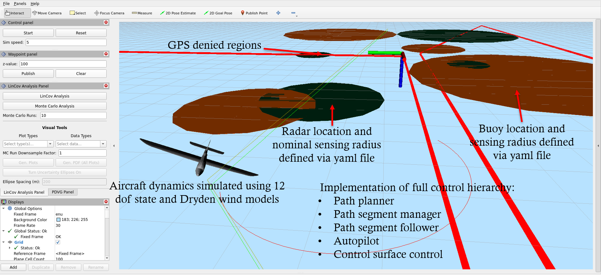
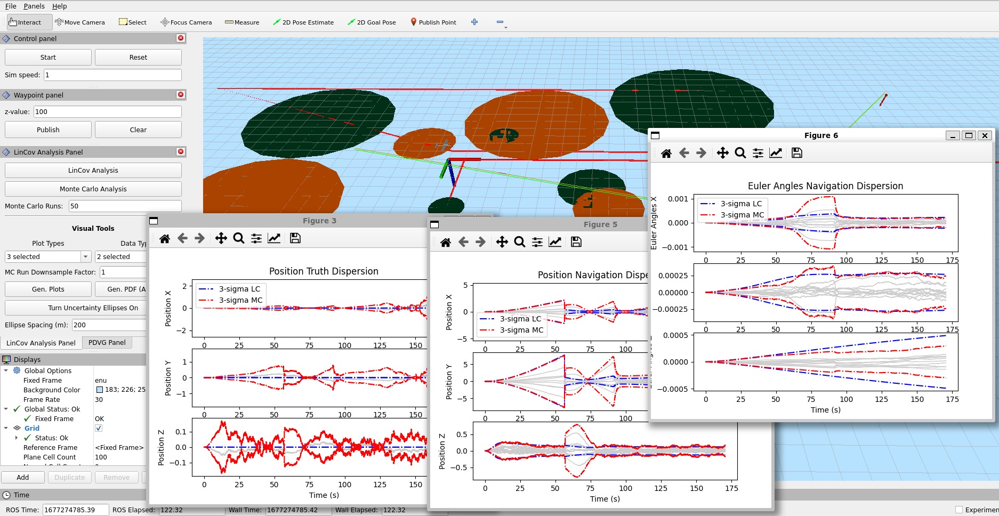
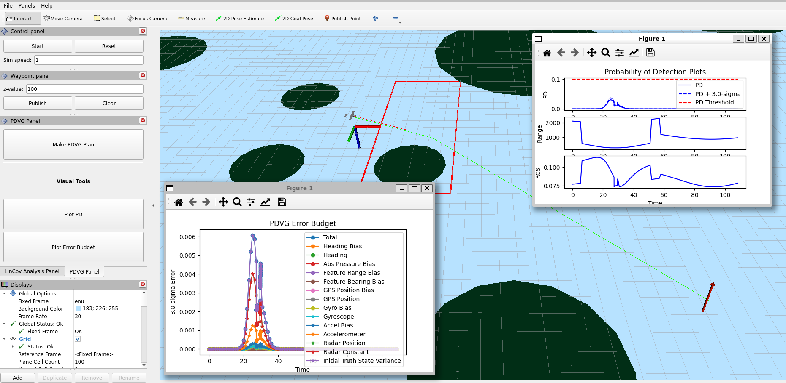
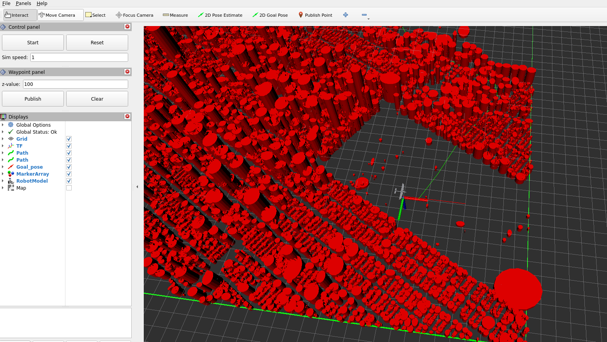

# UAV Simulation

**Table of Contents**
- [Overview](#overview)
- [Download and setup](#download-and-setup)
  - [Downloading the code](#downloading-the-code)
  - [Useful bashrc aliases](#useful-bashrc-aliases)
- [Installing the code](#installing-the-code)
- [Running the code](#running-the-code)
  - [Sourcing workspace](#sourcing-workspace)
  - [Launching the scenario](#launching-the-scenario)
    - [*scenario.launch.py*](#scenariolaunchpy)
    - [*pdvg\_scenario.launch.py*](#pdvg_scenariolaunchpy)
    - [*manhattan\_path\_planner.launch.py*:](#manhattan_path_plannerlaunchpy)

# Overview


This set of packages provides capabilities for planning and analyzing paths through large areas with intermittent GPS.

This document provides a brief overview of installation and running the gps-denied scenario. Additional information can be found in the following locations.
* [Overview.md](documentation/overview.md): Provides an overview of the code base, visualizations, and parameters.
* [Install.md](documentation/install.md): Provides further details on installation
* [Sensor_models.pdf](documentation/Sensor_models.pdf): Provides a description of the sensor models used.
* [rviz_plugins/README.md](rviz_plugins/README.md): Details on the rviz plugins, with special detail given to the LinCov and PDVG panel plugins.
* [docker/README.md](docker/README.md): Details on building, running, and sharing a docker image of the code.

Additional details on nodes and capabilities can be found in the following locations
* [buoy_publisher/README.md](buoy_publisher/README.md): Provides details on the nodes used to publish buoys/radar locations and markers
* [planner_interface/README.md](planner_interface/README.md): Provides details on the LinCov and PDVG planner node interfaces
* [rviz_plugins/README.md](rviz_plugins/README.md): Details on the rviz plugins, with special detail given to the LinCov and PDVG panel plugins.
* [lc_mc_plots_rviz_guide.md](planner_interface/docs/lc_mc_plots_rviz_guide.md): Provides details on the production of plots when the Lincov and Monte Carlo buttons are pressed. It also provides the data format and storage of the Monte Carlo data.
* [mc_plotter_usage.md](planner_interface/docs/mc_plotter_usage.md): Describes how to use the `MCPlotter`
tool to plot data for headless simulations (i.e. simulations that do not use rviz). The tool is provided
in the `planner_interface` package.

Additional launch possibilities can be found in the following README files
* [uav_launch/README.md](uav_launch/README.md): Provides a series of demonstrations of dynamics, control, and planning
* [muav_sim/README.md](muav_soln/mavsim_python/README.md): Provides an overview of the underlying python code used in the simulator.

# Download and setup
## Downloading the code
This repository is dependent on three other repositories found here: https://github.com/james-swedeen/advanced_path_planning, https://github.com/james-swedeen/matplotlibcpp, and https://github.com/james-swedeen/kalman_filter.

## Useful bashrc aliases
The commands below assume that you install the following aliases in your `~/.bashrc` file. For details on installing and compiling without these aliases, see [Install.md](documentation/install.md).

Note that all of the following aliases **must be run from the workspace root**.
* *make_mav_venv*: Creates a virtual environment, installs ros dependencies, and installs the mav_sim package
    ```
    alias make_mav_venv='python3 -m venv --system-site-packages venv && source venv/bin/activate && touch venv/COLCON_IGNORE && rosdep install --from-paths src --ignore-src -r -y && pip install transforms3d && pip install shapely && pip install pandas && pip install -e src/muav_soln/mavsim_python/'
    ```
* *sd*: Used to source the workspace directory correctly when a build is not required.
    ```
    alias sd='source /opt/ros/humble/setup.bash && source venv/bin/activate && . install/setup.bash'
    ```
* *build*: Used to source the ROS2 root, activate the virtual environment (assumed to be *venv*), build, and then source the install
    ```
    alias build='source /opt/ros/humble/setup.bash && source venv/bin/activate && python3 -m colcon build --symlink-install && . install/local_setup.bash'
    ```

# Installing the code
Install ROS Humble. Requires Ubuntu 22.04. Installation instructions can be found on [ros.org](https://docs.ros.org/en/humble/Installation/Ubuntu-Install-Debians.html).

From the workspace root, run the following two commands (aliases created above)
```bash
make_mav_venv
build
```
This will create a virtual environment in the folder `venv`, install dependencies, and compile the code.

A great IDE is very useful, although not required. VSCode has many useful extensions for working with the documentation, code, and ROS. You can install vscode in Ubuntu following the instructions on [visualstudio.com](https://code.visualstudio.com/docs/setup/linux). Useful extensions include
* *Docker* by Microsoft
* *Pylance* by Microsoft
* *Python* by Microsoft
* *C/C++* by Microsoft
* *Markdown All in One* by Yu Zhang
* *ROS* by Microsoft

# Running the code
## Sourcing workspace
**Each time** you open a terminal, you must source the workspace from the workspace root directory. Using the alias defined above, simply type the following command
```bash
sd
```
## Launching the scenario
Once the workspace has been built and sourced, you can run the code. There are currently four scenarios that can be run. Following the launch instructions below will launch the sim and visualization nodes. The various visualizations and sim interaction tools are described in [Overview.md](documentation/overview.md).

1. *scenario.launch.py*: For performing manual waypoint planning. Contains large areas of GPS denied environments.
    ```bash
    ros2 launch pd_planner_launch scenario.launch.py
    ```
    See [rviz_plugins/README.md](rviz_plugins/README.md) for additional details on using the LinCov analysis panel. See [lc_mc_plots_rviz_guide.md](planner_interface/docs/lc_mc_plots_rviz_guide.md) for additional details on how the data is handled.
    

2. *pdvg_scenario.launch.py*: For performing planning using the PDVG planner.
    ```bash
    ros2 launch pd_planner_launch pdvg_scenario.launch.py
    ```
    See [rviz_plugins/README.md](rviz_plugins/README.md) for additional details on using the PDVG panel.
    

3. *headless_sim_scenario.launch.py*: Utilizes a variety of simple scenarios to generate Monte Carlo
   data. This data can be used to verify noise models.
   The scenario used is dependent on the parameters set in [planning.py](pd_planner_launch/pd_planner_launch/params/planning.py).
   Refer to the `Scenario Options` section in the [`planner_interface` package README](planner_interface/README.md)
   for details on the parameter options and more on what each simulation looks like. The user can
   add an optional argument to provide a previously used set of parameters for a new data set.
   ```bash
   ros2 launch pd_planner_launch headless_sim_scenario.launch.py [params_file:=<abs-path-to-params.yaml-file>]
   ```
   See [planner_interface/README.md](planner_interface/README.md) under the `SimManagerNode` heading for additional launch details. See [mc_plotter_usage.md](planner_interface/docs/mc_plotter_usage.md) for details on displaying the results. See [lc_mc_plots_rviz_guide.md](planner_interface/docs/lc_mc_plots_rviz_guide.md) for details on saving the data.

4. *manhattan_path_planner.launch.py*: For performing BIT* planning through a complex environment modeled after Manhattan in New York City.
    ```bash
    ros2 launch pd_planner_launch manhattan_path_planner.launch.py
    ```
    

[def]: #overvi

