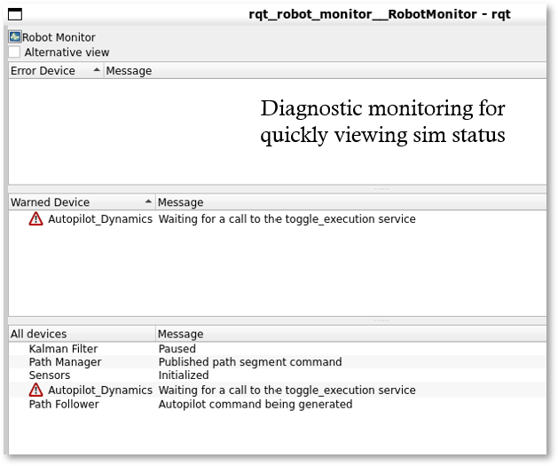
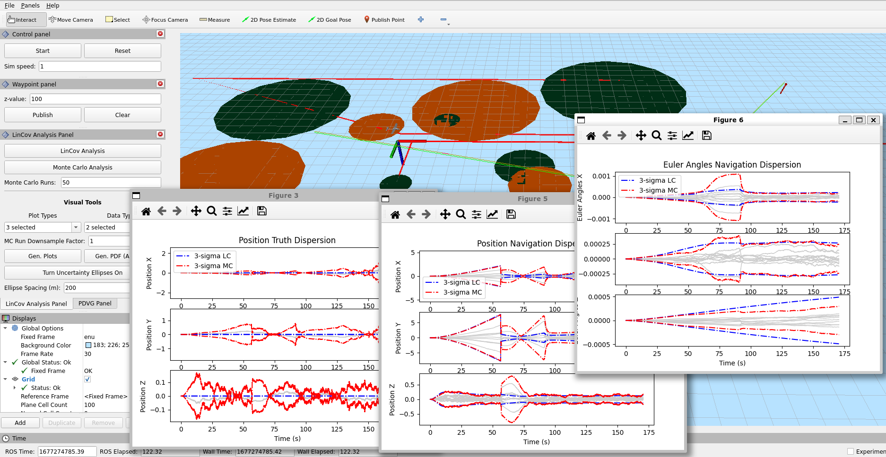

**Table of Contents**
- [Overview](#overview)
  - [Interacting with the simulator](#interacting-with-the-simulator)
    - [RVIZ Panels](#rviz-panels)
    - [RQT Robot Monitor](#rqt-robot-monitor)
    - [RQT](#rqt)
    - [UAV Plots](#uav-plots)
  - [Parameters](#parameters)
  - [Launching the scenario](#launching-the-scenario)
    - [*scenario.launch.py*](#scenariolaunchpy)
    - [*pdvg\_scenario.launch.py*](#pdvg_scenariolaunchpy)
    - [*manhattan\_path\_planner.launch.py*:](#manhattan_path_plannerlaunchpy)


# Overview


This set of packages provides capabilities for planning and analyzing paths through large areas with intermittent GPS. Current capabilities include:
* Visualize large areas environment (radar locations, buoy locations, gps-denied regions, plan, and magnified uav state)
* Visualize state, estimate, and sensor data
* Manually create waypoint paths
* Estimate state of UAV using model-replacement Extended Kalman filter (EKF)
* Follow the paths with a full planning stack for a UAV that considers the UAV dynamics,  control, and state estimate

## Interacting with the simulator
### RVIZ Panels


There are three panels available in RVIZ for interacting with the simulation. The **Control panel** has the following options.

* *Start/Pause*: This will start or pause the uav dynamic updates. When the button shows *Start*, the dynamics will continually publish the same state without being updated.
* *Reset*: Returns the UAV back to the starting position
* *Sim Speed*: Determines the rate at which the sim runs (sim_time/system clock time). The sim will go up to as fast as the sim speed, although it will automatically cap at its fastest speed.

The **Waypoint panel** provides an ability to define a waypoint path. It has the following options. A waypoint is created by using the `2D Goal Pose` tool available in RVIZ. A waypoint path is defined by repeated use of the `2D Goal Pose` to create the path.

* *z-value*: This defines the z-component for the waypoint defined using `2D Goal Pose`. Note that the interpretation of the *z-value* depends upon the frame of reference. For the default *enu* frame (east-north-up), the *z-value* corresponds to the "up" component, i.e., altitude.
* *Publish*: Once this button is clicked, the waypoint path will be published to the path manager for execution. Until it is clicked, the only node ingesting the waypoint path is RVIZ2, which visualizes the path being created.
* *Clear*: This button will clear the waypoint path being created.

The **LinCov and Monte Carlo Analysis Panel** provides the ability to perform linear covariance analysis. A path must be published using the *Waypoint panel* and the following options are possible. For additional details and examples, see [rviz_plugins/README.md](../rviz_plugins/README.md).
* *LinCov Analysis*: Calculates the lincov analysis along the given path
* *Monte Carlo Analysis*: Performs Monte Carlo analysis along the given path
* *Monte Carlo Runs*: Number of runs used for the Monte Carlo Analysis
* *Plot Types*: Categories of the plots to be created
* *Data Types*: Actual states to be plotted for each selected category
* *MC Run Downsample Factor*: Downsampling on the data when storing and plotting the Monte Carlo runs
* *Gen Plots*: Creates the selected plots, which will show up as additional windows
* *Gen PDF (All plots)*: Creates a PDF with all of the possible plots. See [lc_mc_plots_rviz_guide.md](../planner_interface/docs/lc_mc_plots_rviz_guide.md) for additional details.
* *Turn Uncertainty Ellipses On*: Draws uncertainty ellipses in RVIZ. Note that you must zoom in close to the path to see the ellipses.
* *Ellipse Spacing (m)*: The spacing along the path to draw the ellipses.


The **PDVG Panel** allows for planning using the pdvg planner. Currently this is only possible when running `ros2 launch pd_planner_launch pdvg_scenario.launch.py`. The following options are available. For additional details and examples, see [rviz_plugins/README.md](../rviz_plugins/README.md).
* *Make PDVG Plan*: Once a single goal point has been published using the *Waypoint Panel*, this button will plan a path from the UAV location to the goal point while considering the probability of detection.
* *Plot PD*: Plots the following:
  * The probability of detection, $P_D$, along with the uncertainty, $P_D + 3 \sigma$, and the planning threshold
  * The range from the aircraft to the nearest radar over time
  * The RCS over time
* *Plot Error Budget*: Plots the contributors to the probability of detection

### RQT Robot Monitor


Many of the major components of the sim publish diagnostic messages. These can be viewed in the robot monitor. For example, the image above shows the state of the system when the dynamics have been paused and are waiting for "Start" to be clicked in the RVIZ2 *Control Panel*.

### RQT
RQT offers several additional tools that could be useful. For example,
* *Reconfigure*: Allows for configuration of various node parameters on the fly
* *Service caller*: Call / debug node services that are not yet mapped to an Rviz panel
* *Console*: Monitor node outputs

### UAV Plots


The UAV plotter generates a window with three plotting tabs with a host of time-series plots.

* *States*: Plots the actual and estimated states as well as sensory information for some states.
* *Nav Error*: Plots the true navigation error (state actual - state estimate) for each of the states
* *Sensors*: Plots various sensor readings

## Parameters


When the scenario is launched via the following command
```
ros2 launch pd_planner_launch scenario.launch.py
```
then the [gps_denied_scenario.py](../pd_planner_launch/pd_planner_launch/launch/gps_denied_scenario.py) file is run. The beginning of this file initializes a number of parameters. The parameters can be changed in one of three ways.
1. The defaults can be changed directly in the corrsponding parameter class
2. The parameter can be changed in-line directly after initialization
3. The parameter class can be inherited

The inheritance approach could be useful for defining different sensor grades. For example, a navigation or military grade imu could be defined.

The parameters are located in `pd_planner_launch/pd_planner_launch/params/` directory.


## Launching the scenario
Once the workspace has been built and sourced, you can run the code. There are currently three scenarios that can be run.

### *scenario.launch.py*


```bash
ros2 launch pd_planner_launch scenario.launch.py
```
This launch file is intended to be used with manual waypoint planning. Its main feature is that it creates an environment with large areas of GPS denied environments. It can be used to verify the LinCov and Monte Carlo Analysis Panel, but does not currently have a high-level planner. See the description above in **LinCov and Monte Carlo Analysis Panel** for operating the scenario controls.

### *pdvg_scenario.launch.py*


```bash
ros2 launch pd_planner_launch pdvg_scenario.launch.py
```
This launch file is intended for performing planning using the PDVG planner. The same lincov and Monte Carlo analysis panel is also available. See the description above in **PDVG Panel** for operating the controls.

### *manhattan_path_planner.launch.py*:


```bash
ros2 launch pd_planner_launch manhattan_path_planner.launch.py
```
This launch file is inteded for performing BIT* planning through a complex environment. The environment is modeled after Manhattan in New York City. To run the planner, select a point using the `2D Goal Pose` tool and then select `Publish`. You must ensure that the pose is in an obstacle free region.

There are two views available. The first is shown above and comes up by default. However, it may cause the CPU to lag due to the number of objects drawn. A more performant view can be achieved by deselecting `MarkerArray` in the `Displays` panel and instead selecting `Map`. The resulting map view is shown below.


