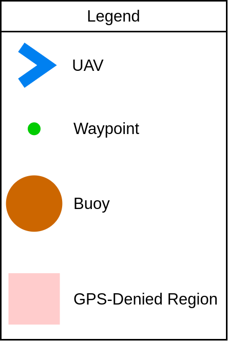
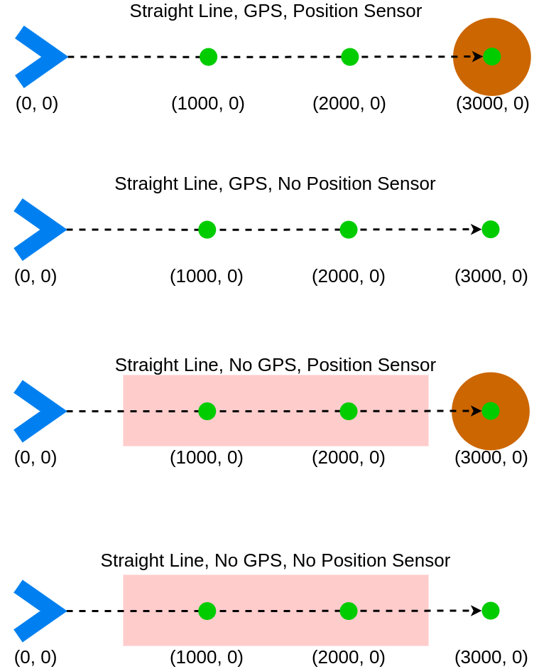
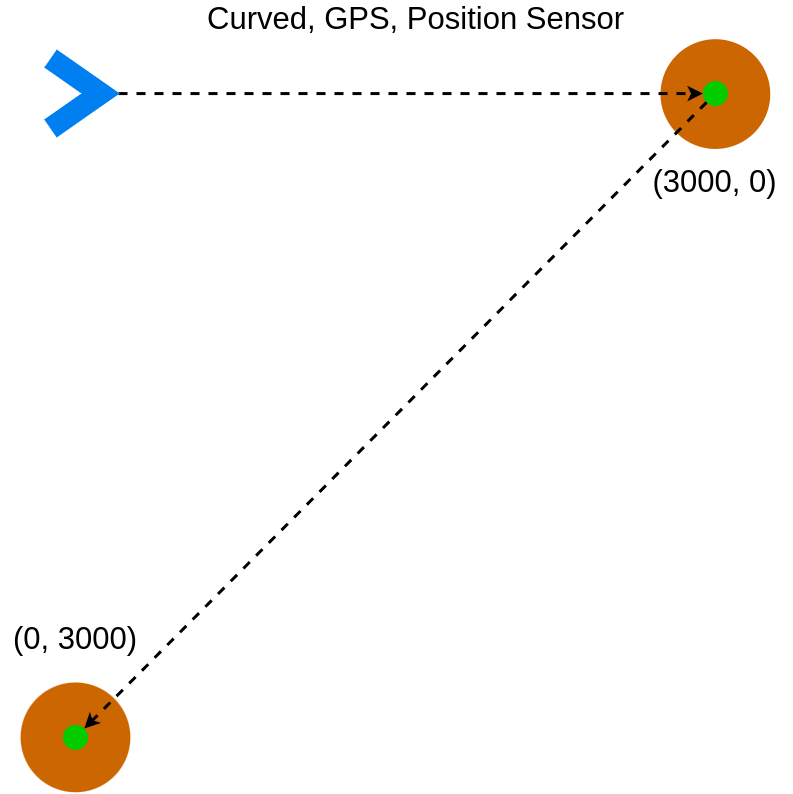
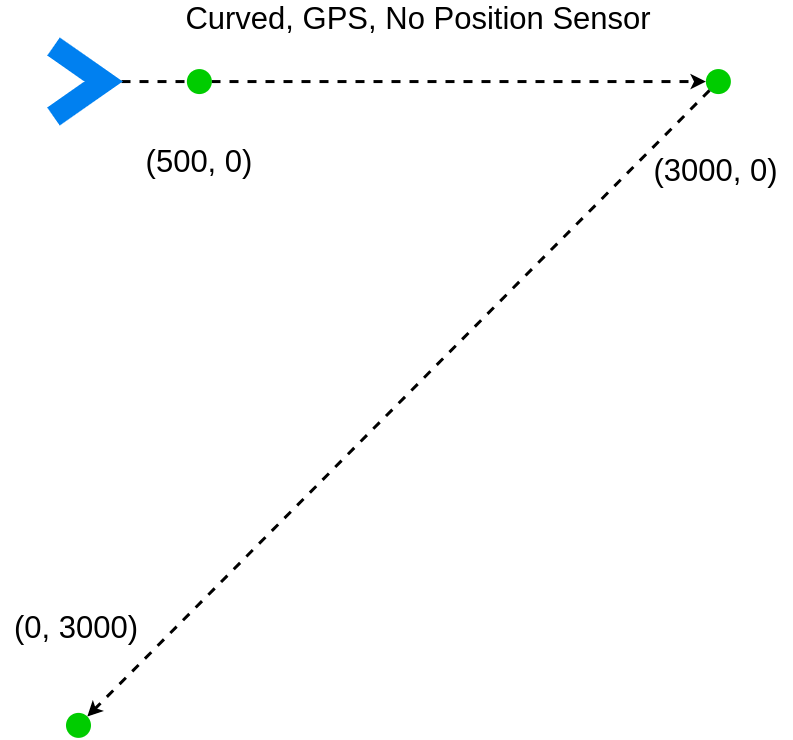
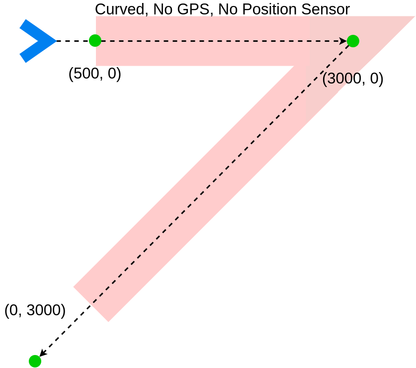
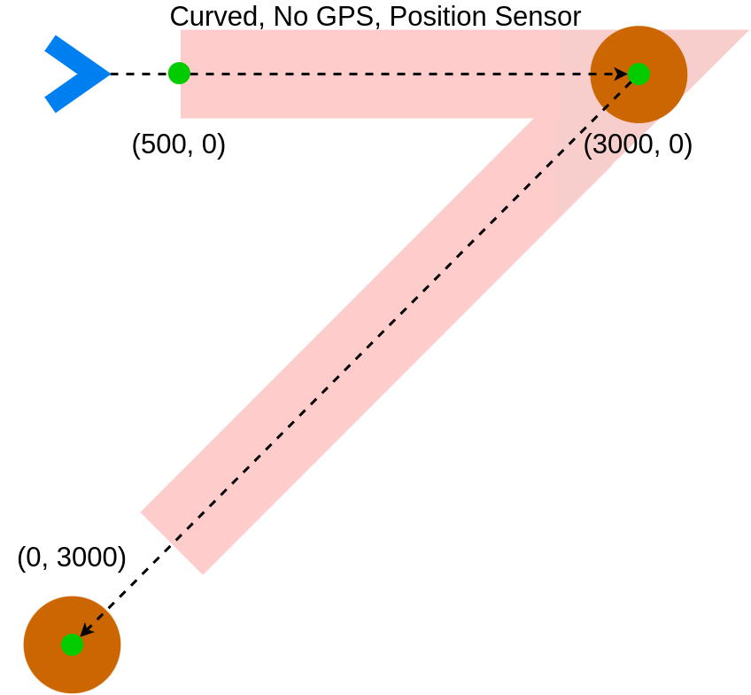
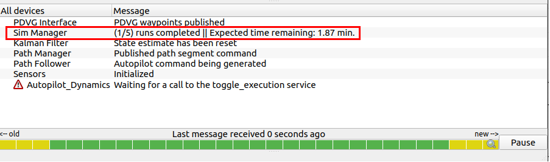
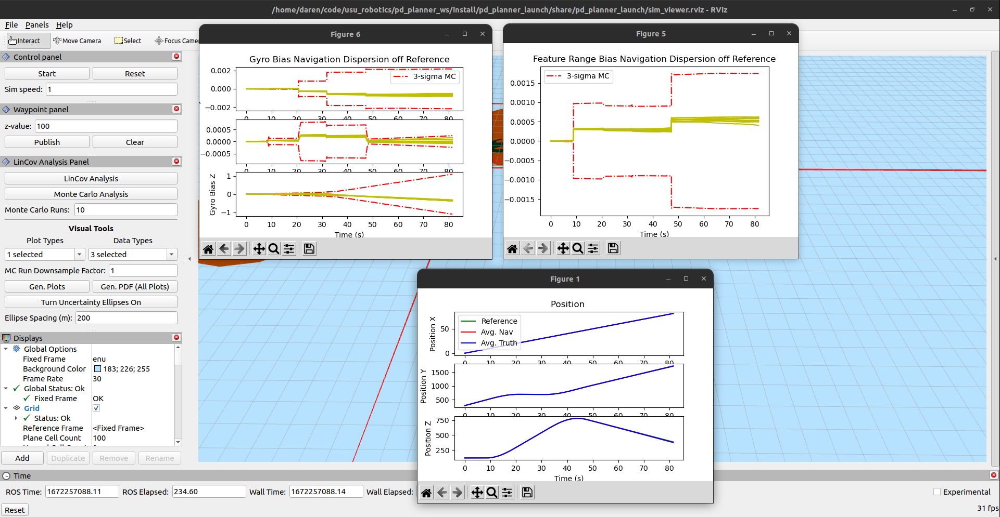
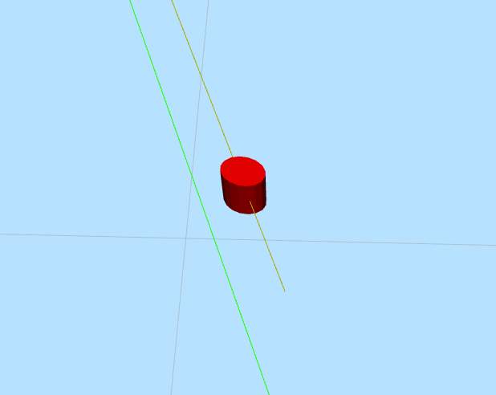

**Table of Contents**
- [Planner Interface](#planner-interface)
  - [Summary](#summary)
  - [`LinCovInterface` Node](#lincovinterface-node)
    - [Launching Scenarios](#launching-scenarios)
    - [Parameters](#parameters)
    - [Interfaces](#interfaces)
  - [`PDVGInterface` Node](#pdvginterface-node)
    - [Launching Scenarios](#launching-scenarios-1)
    - [Parameters](#parameters-1)
    - [Interfaces](#interfaces-1)
  - [`CSVPlotter` Node and Additional Script](#csvplotter-node-and-additional-script)
  - [`SimManagerNode` Node](#simmanagernode-node)
    - [Launching Simulations](#launching-simulations)
    - [Scenario Options](#scenario-options)
    - [Parameters](#parameters-2)
    - [Interfaces](#interfaces-2)
  - [`StateListenerCSVNode` Node](#statelistenercsvnode-node)
    - [Parameters](#parameters-3)
    - [Interfaces](#interfaces-3)
    - [Data Collection and Storage](#data-collection-and-storage)
    - [Example CSV Structure](#example-csv-structure)
  - [Types of Visual Results](#types-of-visual-results)

# Planner Interface
## Summary
This package defines node-based interfaces through which LinCov/Monte Carlo
analyses or PDVG path generation can be performed, either visually using RVIZ, or by headless
simulations, designed more for large amounts of data collection.

The `LinCovInterface` and `PDVGInterface` nodes are used in an RVIZ visual environment. Each one
can perform one-off analyses of their respective algorithms in a way that the user can change easily
by creating new paths for evaluation on the fly. The `LinCovInterface` node supports running both
LinCov and Monte Carlo evaluations on the user-defined paths. The `CSVPlotter` node supports PDVG,
LinCov, and Monte Carlo operations by allowing the user to plot the resulting analysis data.

The `SimManagerNode` node and the `StateListenerCSVNode` node work in tandem to provide a way for
the user to run simulations without RVIZ in order to collect large amounts of data for verification
and validation of the models being used to propagate the UAV state. The `MCPlotter` (short for
'Monte Carlo Plotter') is a non-ROS-based Python script that plots data collected from the
headless simulations. The documentation for the `MCPlotter` can be found in the `docs` subdirectory
of the directory this `README` is in. (`planner_interface/docs/mc_plotter_usage.md`)

See [lc_mc_plots_rviz_guide.md](docs/lc_mc_plots_rviz_guide.md) for details on the production of LinCov and
Monte Carlo plots and the storage of the data.

## `LinCovInterface` Node
The `LinCovInterface` node is used as a tool between the user's interface in `rviz`
and the output of visual components of LinCov and Monte Carlo analyses. Aside from its connection
to the LinCov Analysis Panel, it also uses code in the `kalman_filter` package from the
`rapidly-exploring-random-tree` repo to perform the LinCov and Monte Carlo analyses. Other parts of
that same `kalman_filter` package are utilized to provide a way of converting the analysis data
to different forms that are used in `matplotlibcpp` function or for making CSV files.
The last significant connection the interface node makes is to the `CSVPlotter` node. Through the
`CSVPlotter` node, the analysis data is retrieved from CSV files and displayed with non-blocking
plotting. This allows continued use of the `rviz` interface while simultaneously viewing plots.

This node's analysis functions are accessible from within the `rviz`
simulation environment in the *LinCov Analysis Panel*.
The analysis is static, that is, the analysis only depends
on parts of the initial state of the aircraft and the waypoints published by the user.
Once initial parameters are collected, the analysis can be performed regardless
of the state of the simulation. The initial state for an analysis is
defined by several parameters. The first waypoint in a published path is used
as the UAV starting position.

### Launching Scenarios
The relevant launch files for this node is the `scenario.launch.py` launch file. It is used in a
sourced workspace with the following command:

```
ros2 launch pd_planner_launch scenario.launch.py
```

This will open the scenario using RVIZ, so the radars, buoys, and GPS-denied regions can all be
seen visually. The user can define paths for the UAV to follow and run LinCov and Monte Carlo
analyses on those paths. All functionality from the LinCov Panel can be utilized. The `PDVGInterface`
node is *not* launched with this scenario, so any attempts to use the PDVG Interface Panel will not
work.


### Parameters
|    CSV File Parameters    |  Type  |                        Description                        |
|:--------------------------|:------:|:----------------------------------------------------------|
| `plotting_data_directory` | String | The directory to store CSV files in when generating plots |

|         Buoy Parameters        |     Type    |                                                          Description                                                               |
|:-------------------------------|:-----------:|:-----------------------------------------------------------------------------------------------------------------------------------|
| `features.feature_locations_x` | Float Array | *North* component of each feature, in order they appear in published message.                                                      |
| `features.feature_locations_y` | Float Array | *East* component of each feature, in order they appear in published message.                                                       |
| `features.feature_locations_z` | Float Array | *Down* component of each feature, in order they appear in published message.                                                       |
| `features.feature_ranges`      | Float Array | Range of influence of each feature. Order in the array coincides with the order of the features defined in the `locations` arrays. |

| Uncertainty Ellipse Parameters |     Type    |                                                                             Description                                                                           |
|:-------------------------------|:-----------:|:------------------------------------------------------------------------------------------------------------------------------------------------------------------|
| `ellipses.color`               | Float Array | RGBA array (4 elements) describing the color of the covariance ellipse markers in `rviz`.                                                                         |
| `ellipses.frame_id`            | String      | The frame id the ellipses should appear in.                                                                                                                       |
| `ellipses.test_scale`          | Float       | Scaling factor on the x and y axes of the ellipses. When trying to view in simulation, covariance values can be very small, making the ellipses difficult to see. |

|           Kalman Filter Dynamics Parameters             |    Type     |                                                                               Description                                                                              |
|:--------------------------------------------------------|:-----------:|:-----------------------------------------------------------------------------------------------------------------------------------------------------------------------|
| *`kalman_filter.dynamics.xxxxx_bias.enabled`            | Bool        | Whether or not the bias for a particular type of bias is enabled. *This applies to all bias dictionaries described below.                                              |
| *`kalman_filter.dynamics.xxxxx_bias.standard_deviation` | Float Array | The x, y, and z standard deviation values for a particular type of bias. *This applies to all bias dictionaries described below.                                       |
| *`kalman_filter.dynamics.xxxxx_bias.time_constant`      | Float Array | First Order Gauss Markov (FOGM) time constants for each sensor. *This applies to all bias dictionaries described below.                                                |
| *`kalman_filter.dynamics.xxxxx_bias.zero_mean`          | Bool        | Whether or not to use zero-mean bias. *This applies to all bias dictionaries described below.                                                                          |
| `kalman_filter.dynamics.abs_pressure_bias`              | Dictionary  | Contains `enabled`, `standard_deviation`, `time_constant`, and `zero_mean` values as specified above as they apply to the absolute pressure noise for LinCov analysis. |
| `kalman_filter.dynamics.accel_bias`                     | Dictionary  | Contains `enabled`, `standard_deviation`, `time_constant`, and `zero_mean` values as specified above as they apply to the accelerometer noise for LinCov analysis.     |
| `kalman_filter.dynamics.air_density`                    | Float       | Air density value to be used for the absolute pressure sensor.                                                                                                         |
| `kalman_filter.dynamics.compass_bias`                   | Dictionary  | Contains `enabled`, `standard_deviation`, `time_constant`, and `zero_mean` values as specified above as they apply to the compass noise for LinCov analysis.           |
| `kalman_filter.dynamics.feature_range_bias`             | Dictionary  | Contains `enabled`, `standard_deviation`, `time_constant`, and `zero_mean` values as specified above as they apply to the feature range noise for LinCov analysis.     |
| `kalman_filter.dynamics.feature_bearing_bias`           | Dictionary  | Contains `enabled`, `standard_deviation`, `time_constant`, and `zero_mean` values as specified above as they apply to the feature bearing noise for LinCov analysis.   |
| `kalman_filter.dynamics.gravity_mag`                    | Float       | Gravitational constant.                                                                                                                                                |
| `kalman_filter.dynamics.gps_pos_bias`                   | Dictionary  | Contains `enabled`, `standard_deviation`, `time_constant`, and `zero_mean` values as specified above as they apply to the GPS position noise for LinCov analysis.      |
| `kalman_filter.dynamics.gyro_bias`                      | Dictionary  | Contains `enabled`, `standard_deviation`, `time_constant`, and `zero_mean` values as specified above as they apply to the gyroscope noise for LinCov analysis.         |
| `kalman_filter.integration_time_step`                   | Float       | The time step used when integrating the dynamics forward in time in the LinCov analysis                                                                                |

|               LinCov IMU Parameters                 |    Type     |                                                       Description                                                   |
|:----------------------------------------------------|:-----------:|:--------------------------------------------------------------------------------------------------------------------|
| `lincov.imu.accelerometer.noise.enabled`            | Bool        | Whether or not accelerometer noise is enabled.                                                                      |
| `lincov.imu.accelerometer.noise.standard_deviation` | Float Array | The x, y, and z standard deviation values for the accelerometer. Values here apply specifically to LinCov analyses. |
| `lincov.imu.accelerometer.noise.zero_mean`          | Bool        | Whether or not accelerometer noise is zero-mean.                                                                    |
| `lincov.imu.gyroscope.noise.enabled`                | Bool        | Whether or not gyroscope noise is enabled.                                                                          |
| `lincov.imu.gyroscope.noise.standard_deviation`     | Float Array | The x, y, and z standard deviation values for the gyroscope. Values here apply specifically to LinCov analyses.     |
| `lincov.imu.gyroscope.noise.zero_mean`              | Bool        | Whether or not gyroscope noise is zero-mean.                                                                        |

=====================================================

**Monte Carlo IMU**

Monte Carlo IMU parameters are duplicates of the LinCov IMU parameters for the most part,
except the noise is "disabled" for the LinCov version and enabled for the Monte
Carlo version. "Disabled" here means that the noise parameters are not applied
to the trajectory the aircraft follows.

This is done because the Monte Carlo analysis considers the noise
in the trajectory the aircraft follows in order to generate the estimated 3-sigma
approximation. On the other hand, the LinCov analysis only considers noise as
a predictive measure for the 3-sigma error covariance and assumes the trajectory
is followed perfectly.

=====================================================

|               Monte Carlo IMU Parameters                 |     Type    |                                                     Description                                                     |
|:---------------------------------------------------------|:-----------:|:--------------------------------------------------------------------------------------------------------------------|
| `monte_carlo.imu.accelerometer.noise.enabled`            | Bool        | Whether or not accelerometer noise is enabled.                                                                      |
| `monte_carlo.imu.accelerometer.noise.standard_deviation` | Float Array | The x, y, and z standard deviation values for the accelerometer. Values here apply specifically to LinCov analyses. |
| `monte_carlo.imu.accelerometer.noise.zero_mean`          | Bool        | Whether or not accelerometer noise is zero-mean.                                                                    |
| `monte_carlo.imu.gyroscope.noise.enabled`                | Bool        | Whether or not gyroscope noise is enabled.                                                                          |
| `monte_carlo.imu.gyroscope.noise.standard_deviation`     | Float Array | The x, y, and z standard deviation values for the gyroscope. Values here apply specifically to LinCov analyses.     |
| `monte_carlo.imu.gyroscope.noise.zero_mean`              | Bool        | Whether or not gyroscope noise is zero-mean.                                                                        |

|                Sensor Parameters                |     Type    |                                                                 Description                                                                            |
|:------------------------------------------------|:-----------:|:-------------------------------------------------------------------------------------------------------------------------------------------------------|
| *`sensors.xxx.enabled`                          | Bool        | Whether or not a particular sensor is enabled. *This applies to all sensor types described below.                                                      |
| *`sensors.xxx.measurement_period`               | Float       | Time period between measurements for a given sensor. *This applies to all sensor types described below.                                                |
| *`sensors.xxx.noise.enabled`                    | Bool        | Whether or not a particular sensor's noise is enabled. *This applies to all sensor types described below.                                              |
| *`sensors.xxx.noise.standard_deviation`         | Float Array | The x, y, and z standard deviation for the noise on a particular sensor. *This applies to all sensor types described below.                            |
| *`sensors.xxx.noise.zero_mean`                  | Bool        | Whether or not a particular sensor's noise is zero-mean. *This applies to all sensor types described below.                                            |
| `sensors.abs_pressure`                          | Dictionary  | Contains `enabled`, `measurement_period`, `noise`, and the `noise` sub-values as specified above as they apply to the absolute pressure sensor.        |
| `sensors.abs_pressure.gravity_magnitude`        | Float       | Gravitational constant used by the absolute pressure sensor. This should be the same value as the `gravity_mag` value defined for the Kalman filter.   |
| `sensors.abs_pressure.air_density`              | Float       | Air density value used by the absolute pressure sensor. This should be the same value as the `air_density` value defined for the Kalman filter.        |
| `sensors.altitude`                              | Dictionary  | Contains `enabled`, `measurement_period`, `noise`, and the `noise` sub-values as specified above as they apply to the altitude sensor.                 |
| `sensors.compass`                               | Dictionary  | Contains `enabled`, `measurement_period`, `noise`, and the `noise` sub-values as specified above as they apply to the compass sensor.                  |
| `sensors.feature_bearing`                       | Dictionary  | Contains `enabled`, `measurement_period`, `noise`, and the `noise` sub-values as specified above as they apply to the absolute feature bearing sensor. |
| `sensors.feature_bearing.camera_offset`         | Float Array | The x, y, and z offsets of the camera position with respect to the body frame of the aircraft.                                                         |
| `sensors.feature_bearing.camera_viewing_angles` | Float Array | The rotation from the body frame of the aircraft to the camera pointing direction                                                                      |
| `sensors.feature_range`                         | Dictionary  | Contains `enabled`, `measurement_period`, `noise`, and the `noise` sub-values as specified above as they apply to the feature range sensor.            |
| `sensors.gps`                                   | Dictionary  | Contains `enabled`, `measurement_period`, `noise`, and the `noise` sub-values as specified above as they apply to the GPS sensor.                      |
| `sensors.ground_velocity`                       | Dictionary  | Contains `enabled`, `measurement_period`, `noise`, and the `noise` sub-values as specified above as they apply to the ground velocity sensor.          |

|      Trajectory Parameters      |  Type |                                        Description                                                    |
|:--------------------------------|:-----:|:------------------------------------------------------------------------------------------------------|
| `trajectory.gravity`            | Float | Gravitational constant.                                                                               |
| `trajectory.max_curvature`      | Float | The maximum allowable curvature for the UAV (1/m).                                                    |
| `trajectory.max_curvature_rate` | Float | The maximum allowable curvature rate for the UAV (1/{meter-second}).                                  |
| `trajectory.nominal_pitch`      | Float | Nominal pitch angle of the UAV expressed in degrees. Value is converted to radians when used in code. |
| `trajectory.nominal_velocity`   | Float | Nominal velocity of the UAV (m/s)                                                                     |

### Interfaces
|             Topic             | Interface Type | Function |                Message Type                 |                                                          Description                                                            |
|:------------------------------|:--------------:|:--------:|:--------------------------------------------|:--------------------------------------------------------------------------------------------------------------------------------|
| `diagnostics`                 |      msg       |  Output  | `diagnostic_msgs::msg::DiagnosticArray`     |  Message to indicate the status of the node                                                                                     |
| `lincov_viz`                  |      msg       |  Output  | `visualization_msgs::msg::MarkerArray`      |  Uncertainty Ellipse markers for rviz                                                                                           |
| `waypoints`                   |      msg       |  Input   | `uav_interfaces::msg::UavWaypoints`         |  Waypoints used to generate a reference trajectory for analysis                                                                 |
| `csv_plotter`                 |      srv       |  Server  | `uav_interfaces::srv::SelectAnalysisPlot`   |  A passthrough service that the `CSVPlotter` node uses to generate plots or a PDF file                                          |
| `plot_results`                |      srv       |  Server  | `uav_interfaces::srv::SelectAnalysisPlot`   |  Service that handles data aggregation for plot generation                                                                      |
| `run_analysis`                |      srv       |  Server  | `uav_interfaces::srv::LinCovMonteCarloCall` |  Service that handles performing LinCov or Monte Carlo analyses when either of the analysis buttons are pressed                 |
| `toggle_uncertainty_ellipses` |      srv       |  Server  | `uav_interfaces::srv::ToggleEllipse`        |  Service that handles visibility toggling of the uncertainty ellipses when "Turn Uncertainty Ellipses On/Off" button is pressed |

## `PDVGInterface` Node
The `PDVGInterface` node functions nearly identically to the `LinCovInterface` node from a user's
point of view. Requests, storing data to CSV files, and plotting use the same structure to operate,
with some slight changes as the PDVG interface handles less information.

The `PDVGInterface` node provides services that allow the user to request PDVG plan
generation via RVIZ, much in the same way the LinCov or Monte Carlo calls are made.
After plan generation PDVG-specific plots can be generated on-screen. The user should utilize
the *LinCov Analysis Panel* to create other path-related plots. Refer to the [launch options](#launch-options)
section to learn about some restrictions regarding the use of the `PDVGInterface` and `LinCovInterface`
in combination with one another.

### Launching Scenarios
The relevant launch files for this node is the `pdvg_scenario.launch.py` launch file. It is used in a
sourced workspace with the following command:

```
ros2 launch pd_planner_launch pdvg_scenario.launch.py
```

This opens a scenario using RVIZ such that many radars can be seen. There are also a few GPS-denied
regions. The particular layout of the radars is nicknamed "PDVG Playground". There are a lot of
radars placed in the world with varying sizes and positions. Using this launch file will allow the
user to get PDVG plots as well as LinCov and Monte Carlo plots. One thing to be aware of here
though is that some parameters are very specifically designed for this scenario to work. Based
on the calculations made for the PDVG problem, the radar parameters significantly affect the
feasibility of a trajectory that would be generated by the Monte Carlo or LinCov analysis tools.

To be specific, with the radar parameters found in the `pdvg_scenario.py` file in the `pd_planner_launch`
package, the maximum curvature and maximum curvature rate must be defined (at a minimum) in the
same file as follows:

```
params.nom_traj.max_curvature = 0.02
params.nom_traj.max_curve_rate = 0.02/0.005
```

The first value was calculated during the development of the PDVG scenario, and the second is simply
a scaled version of the original value that the PDVG parameters defined from other scenarios.
Because the radar size changed in the PDVG scenario to be smaller, these two parameters had to be
updated correspondingly. The values shown here should be considered the minimum. Higher values are
possible, but keep in mind that the higher the values, the less realistic the results will be. For
reference, the value of the max curvature indicates that the UAV has a minimum turning radius of
50 meters, which is already beyond realistic.

That fact would go to indicate and make important the mentioning that this scenario was not designed
to be realistic. It was designed to highlight the capability and workings of the PDVG algorithm. Thus,
the user should not expect to get "reasonable" data from this particular scenario.

### Parameters
|    CSV File Parameters    |  Type  |                        Description                        |
|:--------------------------|:------:|:----------------------------------------------------------|
| `plotting_data_directory` | String | The directory to store CSV files in when generating plots |

|   PDVG World Parameters   |     Type    |                                    Description                               |
|:--------------------------|:-----------:|:-----------------------------------------------------------------------------|
| `pdvg_world.world_bounds` | Float Array | Boundaries of the PDVG planning region. Arranged as `xmin, ymin, xmax, ymax` |

|   Visualization Parameters    |  Type  |                        Description                            |
|:------------------------------|:------:|:--------------------------------------------------------------|
| `visualization.frame_id`      | String | The frame id the PDVG solution path Markers should appear in. |

|           Kalman Filter Dynamics Parameters             |    Type     |                                                                               Description                                                                              |
|:--------------------------------------------------------|:-----------:|:-----------------------------------------------------------------------------------------------------------------------------------------------------------------------|
| *`kalman_filter.dynamics.xxxxx_bias.enabled`            | Bool        | Whether or not the bias for a particular type of bias is enabled. *This applies to all bias dictionaries described below.                                              |
| *`kalman_filter.dynamics.xxxxx_bias.standard_deviation` | Float Array | The x, y, and z standard deviation values for a particular type of bias. *This applies to all bias dictionaries described below.                                       |
| *`kalman_filter.dynamics.xxxxx_bias.time_constant`      | Float Array | First Order Gauss Markov (FOGM) time constants for each sensor. *This applies to all bias dictionaries described below.                                                |
| *`kalman_filter.dynamics.xxxxx_bias.zero_mean`          | Bool        | Whether or not to use zero-mean bias. *This applies to all bias dictionaries described below.                                                                          |
| `kalman_filter.dynamics.abs_pressure_bias`              | Dictionary  | Contains `enabled`, `standard_deviation`, `time_constant`, and `zero_mean` values as specified above as they apply to the absolute pressure noise for LinCov analysis. |
| `kalman_filter.dynamics.accel_bias`                     | Dictionary  | Contains `enabled`, `standard_deviation`, `time_constant`, and `zero_mean` values as specified above as they apply to the accelerometer noise for LinCov analysis.     |
| `kalman_filter.dynamics.compass_bias`                   | Dictionary  | Contains `enabled`, `standard_deviation`, `time_constant`, and `zero_mean` values as specified above as they apply to the compass noise for LinCov analysis.           |
| `kalman_filter.dynamics.feature_bearing_bias`           | Dictionary  | Contains `enabled`, `standard_deviation`, `time_constant`, and `zero_mean` values as specified above as they apply to the feature bearing noise for LinCov analysis.   |
| `kalman_filter.dynamics.feature_range_bias`             | Dictionary  | Contains `enabled`, `standard_deviation`, `time_constant`, and `zero_mean` values as specified above as they apply to the feature range noise for LinCov analysis.     |
| `kalman_filter.dynamics.gps_pos_bias`                   | Dictionary  | Contains `enabled`, `standard_deviation`, `time_constant`, and `zero_mean` values as specified above as they apply to the GPS position noise for LinCov analysis.      |
| `kalman_filter.dynamics.gyro_bias`                      | Dictionary  | Contains `enabled`, `standard_deviation`, `time_constant`, and `zero_mean` values as specified above as they apply to the gyroscope noise for LinCov analysis.         |

|                 IMU Parameters               |    Type     |                          Description                             |
|:---------------------------------------------|:-----------:|:-----------------------------------------------------------------|
| `imu.accelerometer.noise.enabled`            | Bool        | Whether or not accelerometer noise is enabled.                   |
| `imu.accelerometer.noise.standard_deviation` | Float Array | The x, y, and z standard deviation values for the accelerometer. |
| `imu.accelerometer.noise.zero_mean`          | Bool        | Whether or not accelerometer noise is zero-mean.                 |
| `imu.gyroscope.noise.enabled`                | Bool        | Whether or not gyroscope noise is enabled.                       |
| `imu.gyroscope.noise.standard_deviation`     | Float Array | The x, y, and z standard deviation values for the gyroscope.     |
| `imu.gyroscope.noise.zero_mean`              | Bool        | Whether or not gyroscope noise is zero-mean.                     |

|                Sensor Parameters                |     Type    |                                                                 Description                                                            |
|:------------------------------------------------|:-----------:|:---------------------------------------------------------------------------------------------------------------------------------------|
| *`sensors.xxx.enabled`                          | Bool        | Whether or not a particular sensor is enabled. *This applies to all sensor types described below.                                      |
| *`sensors.xxx.measurement_period`               | Float       | Time period between measurements for a given sensor. *This applies to all sensor types described below.                                |
| *`sensors.xxx.noise.enabled`                    | Bool        | Whether or not a particular sensor's noise is enabled. *This applies to all sensor types described below.                              |
| *`sensors.xxx.noise.standard_deviation`         | Float Array | The x, y, and z standard deviation for the noise on a particular sensor. *This applies to all sensor types described below.            |
| *`sensors.xxx.noise.zero_mean`                  | Bool        | Whether or not a particular sensor's noise is zero-mean. *This applies to all sensor types described below.                            |
| `sensors.altitude`                              | Dictionary  | Contains `enabled`, `measurement_period`, `noise`, and the `noise` sub-values as specified above as they apply to the altitude sensor. |
| `sensors.compass`                               | Dictionary  | Contains `enabled`, `measurement_period`, `noise`, and the `noise` sub-values as specified above as they apply to the compass sensor.  |
| `sensors.gps`                                   | Dictionary  | Contains `enabled`, `measurement_period`, `noise`, and the `noise` sub-values as specified above as they apply to the GPS sensor.      |

|      Trajectory Parameters      | Type  |                                        Description                                                    |
|:--------------------------------|:-----:|:------------------------------------------------------------------------------------------------------|
| `trajectory.fillet_dt`          | Float | Step size (in meters) for generating points on a fillet path                                          |
| `trajectory.gravity`            | Float | Gravitational constant.                                                                               |
| `trajectory.line_dt`            | Float | Step size (in meters) for generating points on a line path                                            |
| `trajectory.max_curvature`      | Float | The maximum allowable curvature for the UAV (1/m).                                                    |
| `trajectory.max_curvature_rate` | Float | The maximum allowable curvature rate for the UAV (1/{meter-second}).                                  |
| `trajectory.nominal_pitch`      | Float | Nominal pitch angle of the UAV expressed in degrees. Value is converted to radians when used in code. |
| `trajectory.nominal_velocity`   | Float | Nominal velocity of the UAV (m/s)                                                                     |
| `trajectory.use_arc_fillet`     | Bool  | If true, use ArcFilletIMUEdgeGenerator, otherwise, use EulerSpiralIMUEdgeGenerator                    |

|        Obstacle Checker Parameters       |     Type    |                                            Description                                        |
|:-----------------------------------------|:-----------:|:----------------------------------------------------------------------------------------------|
| `obstacle_checker.ellipsoid_axes`        | Float Array | A 3-element vector describing the axis lengths of the ellipsoid detection model               |
| `obstacle_checker.nominal_cross_section` | Float       | Nominal cross section of the aircraft with respect to any radar                               |
| `obstacle_checker.pd_threshold`          | Float       | Probability of detection threshold for all radars                                             |
| `obstacle_checker.prob_false_alarms`     | Float       | Probability of false alarm for all radars                                                     |
| `obstacle_checker.radar_locations_x`     | Float Array | Vector of radar x positions.                                                                  |
| `obstacle_checker.radar_locations_y`     | Float Array | Vector of radar y positions.                                                                  |
| `obstacle_checker.radar_locations_z`     | Float Array | Vector of radar z positions.                                                                  |
| `obstacle_checker.radar_consts`          | Float Array | Radar constants for each radar                                                                |
| `obstacle_checker.radar_pos_std_dev`     | Float       | Standard deviation for radar position for all radars                                          |
| `obstacle_checker.radar_const_std_dev`   | Float       | Standard deviation for radar constants for all radars                                         |
| `obstacle_checker.starting_num_sides`    | Int         | Starting number of sides for obstacle checking in PDVG process                                |
| `obstacle_checker.std_dev_multiple`      | Float       | The multiple of the standard deviation that has to be below pd_threshold to succeed PDVG plan |

### Interfaces
|     Topic     | Interface Type | Function |                Message Type               |                                                Description                                                  |
|:--------------|:--------------:|:--------:|:------------------------------------------|:------------------------------------------------------------------------------------------------------------|
| `diagnostics` |      msg       |  Output  | `diagnostic_msgs::msg::DiagnosticArray`   |  Message to indicate the status of the node                                                                 |
| `pdvg_path`   |      msg       |  Output  | `visualization_msgs::msg::MarkerArray`    |  A series of markers that make up a LINESTRIP marker type. When published, they show the planned PDVG route |
| `waypoints`   |      msg       |  Input   | `uav_interfaces::msg::UavWaypoints`       |  Waypoints used to generate a reference trajectory for analysis                                             |
| `uav_state`   |      msg       |  Input   | `uav_interfaces::msg::UavState`           |  UAV state messages to extract current position of UAV from                                                 |
| `csv_plotter` |      srv       |  Server  | `uav_interfaces::srv::SelectAnalysisPlot` |  A passthrough service that the `CSVPlotter` node uses to generate plots or a PDF file                      |
| `pdvg_plot`   |      srv       |  Server  | `uav_interfaces::srv::SelectAnalysisPlot` |  Service that handles data aggregation for plot generation                                                  |
| `run_pdvg`    |      srv       |  Server  | `std_srvs::srv::Trigger`                  |  Service that activates PDVG planning                                                                       |


## `CSVPlotter` Node and Additional Script
The `CSVPlotter` node retrieves passthrough information from the `rviz` *LinCov Analysis Panel*
or the *PDVG Panel* after relevant data has been saved to CSV files. After this
information about the user-specified plots is received, a flag is set indicating that data can be
plotted. From there, due to the nature of `matplotlib` plotting features, a Python script running
in the main thread takes over. The Python script takes information about the requested plots from
the `CSVPlotter` node, accesses CSV files created by the `LinCovInterface` or `PDVGInterface`
nodes, then plots the data. The Python script is also used to generate a PDF of all possible
plots as requested.

The `CSVPlotter` node utilizes parameters defined in the `csv_tools.py` file located in the
`planner_interface` sub-directory. Refer to that file for documentation about what parameters
are being used. The parameters there are mirrored in the `csv_tools.hpp` in the `include` directory.
For more information, refer to the `lc_mc_plots_rviz_guide.md` file in the `docs` folder.
To summarize, those parameters define how the CSV data directory is created. The data location is
defined as a `ros` parameter for the `LinCovInterface` and `PDVGInterface` nodes.

## `SimManagerNode` Node
The `SimManagerNode` node offers a way for the user to run real-time Monte Carlo simulations without
the use of RVIZ. The node connects the minimum necessary services to set a goal pose, generate a
path plan, and follow it, all while recording truth and navigation state data.

Parameters for the runs are defined and used in the `pd_planner_launch` package through the following files:
- `create_uav_sim_headless.py` (Sets up the simulation environment)
- `node_dict.py` (Implements function to make parameter dictionary)
- `planning.py` (Defines `SimManager` and `HeadlessSimSelect` classes with parameters)

The parameters listed below in the Parameters section are each critical to the function of the node.
As the intent of this node is to aid in data collection for Monte Carlo testing, the user should
make sure that each of the parameters are set correctly before starting a run. Predefined sets of
parameters have been implemented for running some basic test scenarios that can be used for data
collection and verification. These scenarios can be run by using the launch files from the
`pd_planner_launch` package.

When running these scenarios, as it is anticipated that the user intends on collecting and saving
data for evaluation later, it is important to know what needs to happen in order to run each of
the scenarios. A good system of launching these different configurations is important to maintain
since new tests can be added and there could be quite a few testing options after a while.

### Launching Simulations
To use the `SimManagerNode`, a launch file has been created in the `pd_planner_launch` package called
`headless_sim_scenario.launch.py`. It can be run with the following command, assuming a sourced workspace:

```bash
ros2 launch pd_planner_launch headless_sim_scenario.launch.py
```

When this command is run, the user will be prompted with questions about the test that they are
running. The prompts will look similar to this:

```
=== PLEASE ENTER DATA INFO ===
Press [Enter] to skip README creation
Enter the tester's name:
>>> Daren
Is this test using Straight Line? (y/n)
>>> y
Is this test using Curved Line? (y/n)
>>> n
Is this test using GPS-Denied Areas? (y/n)
>>> n
Is this test using Position sensor? (y/n)
>>> y
Enter the reason for testing:
>>> Collecting basic data
```

This prompt system has been implemented to ensure that for important simulations, notes can be
collected about the test so that later when looking back at the data, you can remember the
reasoning behind collecting the data, and what kind of test it was. All the responses are collected
and formatted into a `README.txt` file that is stored in the same top-level folder that contains
all the `run` folders for a given simulation. The information that appears in the prompts can
be modified in the `collect_test_info` function in `pd_planner_launch/pd_planner_launch/params/csv_directory.py`.
If you do not need to enter this information, simply press *Enter* when prompted with the first
question, and everything will be skipped, and a `README` will not be generated.

To run different types of simulations, you can utilize the `HeadlessSimSelect` class defined
in `pd_planner_launch/pd_planner_launch/params/planning.py`. To change the test that will be run,
simply change the parameters in that class. Current options for testing include what is shown in
the *Scenario Options* table below. Other parameters for simulation such as the number of runs and
the simulation speed can be set in the `SimManager` class from the `planning.py` file.

Due to the current implementation, setting the clock speed to something higher than approximately
`2.0` unfortunately will not increase the simulation speed because the time-steps taken by the
simulation are dependent on a sleep function. Realistically this limits any updates to occur, at the
fastest, at a `1 ms` period due to OS limitations.

A workaround for this issue is to use multiple simultaneous runs, so long as multiple
`ROS_DOMAIN_IDs` are available and the hardware on the testing computer is sufficient. To run
multiple simulations at the same time, you can utilize the following script (notice that you will
need to fill in the path to the workspace setup script and the `ROS_DOMAIN_IDs`):

```bash
#! /bin/bash

source <path_to_your_ros_workspace>/install/setup.bash

gnome-terminal -- bash -c "ROS_DOMAIN_ID=XX && ros2 launch pd_planner_launch headless_sim_scenario.launch.py"
sleep 2
gnome-terminal -- bash -c "ROS_DOMAIN_ID=XX && ros2 launch pd_planner_launch headless_sim_scenario.launch.py"
sleep 2
gnome-terminal -- bash -c "ROS_DOMAIN_ID=XX && ros2 launch pd_planner_launch headless_sim_scenario.launch.py"
sleep 2
gnome-terminal -- bash -c "ROS_DOMAIN_ID=XX && ros2 launch pd_planner_launch headless_sim_scenario.launch.py"
```

Before using the script, make sure you have already sourced ROS and activated your virtual
environment if you are using one. Each `XX` represents a `ROS_DOMAIN_ID` that is available for use.
The script opens new terminal windows and runs the launch command in each of them. The `sleep`
command is used to ensure that there are no race conditions for folder creation during startup.

If multiple simulations are run at once, the recommended method of handling the user prompts for
test information is to simply use the *skip* feature mentioned at the beginning of this section for
all but the last simulation (the simulation that uses the highest numbered data folder). Then when
runs are complete, for any folders that were a part of that data set, you can move the `run` folders
from each `data` folder into the highest-numbered `data` folder. From there, the `MCPlotter`
(learn about the `MCPlotter` in location mentioned at the bottom of the [Summary section](#Summary)) can be
used to generate plots of the whole data set.

### Scenario Options
List of parameters associated with choosing different test types for headless simulations.

|        Parameter       |  Type   |                                                                          Description                                                                          |
|:-----------------------|:-------:|:--------------------------------------------------------------------------------------------------------------------------------------------------------------|
| `line_type`            | Integer | Chooses the waypoints that will be used, either following a straight line or taking a curved path. Valid numbers are defined in the `HeadlessSimSelect` class |
| `use_gps_denied_areas` | Boolean | Flag indicating whether to use GPS-denied regions in the simulation                                                                                           |
| `use_position_sensor`  | Boolean | Flag indicating whether to use the feature sensor in the simulation                                                                                           |

The different basic scenarios can be visualized as follows:

| Description | Image |
|:------------|:-----:|
| Legend for the icons in each image | |
| All straight-line cases ||
| Curved-trajectory scenario, using GPS and the position sensor ||
| Curved-trajectory scenario, using GPS and no position sensor ||
| Curved-trajectory scenario, no GPS and no position sensor||
| Curved-trajectory scenario, no GPS and with position sensor||

### Parameters
List of parameters that are used in the node.

| General Parameters |  Type   |                                                                Description                                                              |
|:-------------------|:-------:|:----------------------------------------------------------------------------------------------------------------------------------------|
| `clock_speed`      | Float   | Desired clock speed for the simulation, where `clock_speed` is defined as simulation seconds per real-time second.                      |
| `manual_wp_x`      | Float   | Set of x-positions of waypoints defining a simple path. Used if the SimManager parameter `use_pdvg` is `False`                          |
| `manual_wp_y`      | Float   | Set of y-positions of waypoints defining a simple path. Used if the SimManager parameter `use_pdvg` is `False`                          |
| `min_radius`       | Float   | Specifies the minimum radius turn the UAV can make. Set in the manual waypoints so the path manager can handle the turns appropriately. |
| `nominal_down`     | Float   | Nominal down value for the target waypoint                                                                                              |
| `nominal_velocity` | Float   | Nominal velocity for the aircraft to maintain when following the path                                                                   |
| `path_type`        | String  | Type of path to use when making manual path. Options are `fillet`, `straight_line`, or `dubins`                                         |
| `pdvg_x_pos`       | Float   | Goal pose x-position (North in NED frame)                                                                                               |
| `pdvg_y_pos`       | Float   | Goal pose y-position (East in NED frame)                                                                                                |
| `total_runs`       | Integer | Number of Monte Carlo runs to perform                                                                                                   |
| `use_pdvg`         | Boolean | Flag indicating whether to use the PDVG waypoints. If true, uses `pdvg_x/y_pos`, if false, uses manual waypoints.                       |


### Interfaces
List of service/client and pub/sub topics present in the node.

|                  Topic                 | Interface Type | Function |                Message Type             |                                                                                                                             Description                                                                                                                         |
|:---------------------------------------|:--------------:|:--------:|:----------------------------------------|:----------------------------------------------------------------------------------------------------------------------------------------------------------------------------------------------------------------------------------------------------------------|
| `/diagnostics`                         |      msg       |  Output  | `diagnostic_msgs::msg::DiagnosticArray` | Message to indicate the status of the node. Shows how many runs have been completed and the estimated time to completion of entire simulation                                                                                                                   |
| `/end_path_reached`                    |      msg       |  Input   | `std_msgs::msg::Empty`                  | A message sent from the `ch11_path_manager` node indicating that the path has been followed to completion                                                                                                                                                       |
| `/kalman_filter_start_pause_srv_topic` |      srv       |  Client  | `std_srvs::srv::Empty`                  | Call to start or stop the kalman filter from producing the navigation state                                                                                                                                                                                     |
| `/kalman_filter_reset_srv_topic`       |      srv       |  Client  | `std_srvs::srv::Empty`                  | Call to reset the kalman filter state back to initial conditions                                                                                                                                                                                                |
| `/nav_state_listener_toggle_topic`     |      srv       |  Client  | `std_srvs::srv::Empty`                  | Call to the `StateListenerCSVNode` specified for navigation data to start or stop collecting data. At launch, the behavior is always to be stopped until after confirming the PDVG path has been generated                                                      |
| `/path_ready`                          |      msg       |  Input   | `std_msgs::msg::Empty`                  | Subscriber that listens to the `path_ready` topic that is published to by the path manager node. A message is sent when the last waypoint of a path is reached.                                                                                                 |
| `/reset_autopilot`                     |      srv       |  Client  | `std_srvs::srv::Empty`                  | CAll to the autopilot node to reinstantiate its controllers to reduce effects of integrator windup when starting a new run.                                                                                                                                     |
| `/reset_nav_listener`                  |      srv       |  Client  | `std_srvs::srv::SetBool`                | Call to the `StateListenerCSVNode` specified for nav data. If the boolean value sent is true, it is the end of the simulation, and the `StateListenerCSVNode` should terminate. Otherwise, close files and prepare additional folders and files for a new run   |
| `/reset_state`                         |      srv       |  Client  | `std_srvs::srv::Empty`                  | Call to reset the `uav_state` to initial conditions. This call is made after each run finishes to put the UAV back in its starting pose                                                                                                                         |
| `/reset_truth_listener`                |      srv       |  Client  | `std_srvs::srv::SetBool`                | Call to the `StateListenerCSVNode` specified for truth data. If the boolean value sent is true, it is the end of the simulation, and the `StateListenerCSVNode` should terminate. Otherwise, close files and prepare additional folders and files for a new run |
| `/run_pdvg`                            |      srv       |  Server  | `std_srvs::srv::Trigger`                | Service that activates PDVG planning                                                                                                                                                                                                                            |
| `/set_clock_params`                    |      srv       |  Client  | `uav_interfaces::srv::SetClockParams`   | Set the clock parameters for speeding up simulation                                                                                                                                                                                                             |
| `/start_pause_sense_auto_dyn`          |      srv       |  Client  | `std_srvs::srv::Empty`                  | Call to start or stop autopilot updates.                                                                                                                                                                                                                        |
| `/truth_state_listener_toggle_topic`   |      srv       |  Client  | `std_srvs::srv::Empty`                  | Call to the `StateListenerCSVNode` specified for truth data to start or stop collecting data. At launch, the behavior is always to be stopped until after confirming the PDVG path has been generated                                                           |
| `/toggle_execution`                    |      srv       |  Client  | `std_srvs::srv::Empty`                  | Call to start or stop the dynamics. The main node that utilizes this is the `ch07_sensors_auto_dyn` node. It indirectly affects a `ch04_dynamic_mav_node` and `ch06_autopilot_node` that are instantiated via the `ch07` node                                   |
| `/waypoints`                           |      msg       |  Input   | `uav_interfaces::msg::UavWaypoints`     | Waypoints used to generate a reference trajectory for analysis                                                                                                                                                                                                  |

Lastly, here is a reference image for what the `SimManagerNode` diagnostic status looks like during
operation. The status will show `Initialized` until the first run has been completed, at which point
the remaining runs and run time will be shown.




## `StateListenerCSVNode` Node
The `StateListenerCSVNode` node is used for data collection during headless Monte Carlo simulations.
Its job is simple, to listen to the truth or navigation state of the UAV during Monte Carlo runs
and save all that data into a set of CSV files that can be read from and plotted later.

It utilizes a callback when shutdown occurs so the files that it could be in the middle of writing
are safely saved and stored before the node terminates itself.

Parameters for this node are defined and used in the `pd_planner_launch` package through the following files:
- `create_uav_sim_headless.py` (Sets up the simulation environment)
- `node_dict.py` (Implements function to make parameter dictionary)
- `csv_directory.py` (Defines `StateListener` class with parameters)

### Parameters
| General Parameters |  Type   |                                                                           Description                                                                                    |
|:-------------------|:-------:|:-------------------------------------------------------------------------------------------------------------------------------------------------------------------------|
| `row_limit`        | Integer | How many rows can be created in a CSV file before creating a new one                                                                                                     |
| `data_directory`   | String  | Top-level directory to store run data in. Subdirectories are created from here with the number of each run. This parameter is defined in the `csv_directory` params file |
| `precision`        | Integer | Precision with which to store the data. This is stored in fixed precision (i.e. number of significant digits after the decimal point)                                    |
| `get_truth_data`   | Boolean | Flag used to choose what file prefix to use, either `truth_` or `nav_`.                                                                                                  |

### Interfaces
|             Topic              | Interface Type | Function |           Message Type          |                                                                                                                                 Description                                                                                                            |
|:-------------------------------|:--------------:|:--------:|:--------------------------------|:-------------------------------------------------------------------------------------------------------------------------------------------------------------------------------------------------------------------------------------------------------|
| `/state_topic`                 |      msg       |  Input   | `uav_interfaces::msg::UavState` | Topic that publishes either the truth or the nav state of the UAV depending on how node is set up in launch file. Callback is used to save data to file.                                                                                               |
| `/state_listener_toggle_topic` |      srv       |  Server  | `std_srvs::srv::Empty`          | If this request is received, data collection will be toggled to enabled/disabled in response to the start or end of a run, respectively                                                                                                                |
| `/reset_listener`              |      srv       |  Server  | `std_srvs::srv::SetBool`        | Responds to requests from the `SimManagerNode`. If the boolean value received is true, it is the end of the simulation, and the `StateListenerCSVNode` should terminate. Otherwise, close files and prepare additional folders and files for a new run |

### Data Collection and Storage
Below a simple example of the data collection and storage process is used to explain how the
`StateListenerCSVNode` records incoming data.

In the `csv_directory.py` file, there is a variable defined for the test data location
for headless runs. A great place to set this value to could be the home directory in a
subfolder called `test_data_headless`. This folder will be created upon launch the
headless simulation if the folder doesn't already exist. If some simulations have already
been run before, there will be a directory structure that looks like this:

```
- test_data_headless
|
| - data_000
| - data_001
  | - run_000
  | - run_001
    | - nav_000.csv
    | - truth_000.csv
    | - COMPLETED
  | params.yaml
  | README.txt
```

Upon the launch of the headless simulation, a Python script checks the highest-valued
`data` folder and creates a new one with an incremented number. This way, each time
a simulation is run it will have its own folder to store data in to keep things
organized. A parameters file is also created and saved in this location, making it easy to
verify what kind of parameters were used for the majority of the nodes. The parameters do not
include everything about all the classes though, so it is partially up to the you to explain
some testing conditions in the `README.txt` file.

The `README` is generated with the help of the user upon the launch of
`headless_sim_scenario.launch.py` from the `pd_planner_launch` package. More information is
available in the [`SimManagerNode`](#simmanagernode-node) section above.

In each `data_xxx` folder, there will be folders titled `run_xxx`. If the simulation
is run until completion, there should be the same number of run folders as there were
runs specified in the parameters for the headless simulation.

Each run folder will have two types of data files, `truth_xxx.csv` and `nav_xxx.csv`.
These contain the truth and navigation data as you would expect. If a longer run is being
performed and one of these files hits the `row_limit` number of rows in the CSV file,
a new file will be created with an incremented number. Each file contains the Monte Carlo data
along the columns with headers indicating what type of data it is. The first column should
always be the time information.

The last file that could be in a `run` folder is the `COMPLETED` file. If this file is
in a `run` folder, it means that the particular run under inspection was successfully
completed.

Here is a quick example of what to expect in the CSV files

### Example CSV Structure

|Time| Position X  | Position Y  | Position Z  | Phi | Theta | Psi | Velocity X | ... |
|:--:|:--:|:--:|:--:|:--:|:--:|:--:|:--:|:--:|
|....|....|....|....|....|....|....|....|....|

## Types of Visual Results
After an analysis is performed, the results can be visualized via `matplotlib` or
by `rviz2`.

The `matplotlib` option generates plots over the time-steps of the LinCov
or Monte Carlo analyses corresponding to the 3-sigma bounds of the error
covariances for several different states.

The other option for visualization is generating 3-sigma uncertainty ellipses along the path in the
x-y plane (or N-E plane). These ellipses can be extremely small depending on the scale
of the simulation environment, so be aware of that if you are trying to look for them.

|       Example       |                                      Image                                       |
|:--------------------|:--------------------------------------------------------------------------------:|
| Plotting            |               |
| Uncertainty Ellipse |  |
