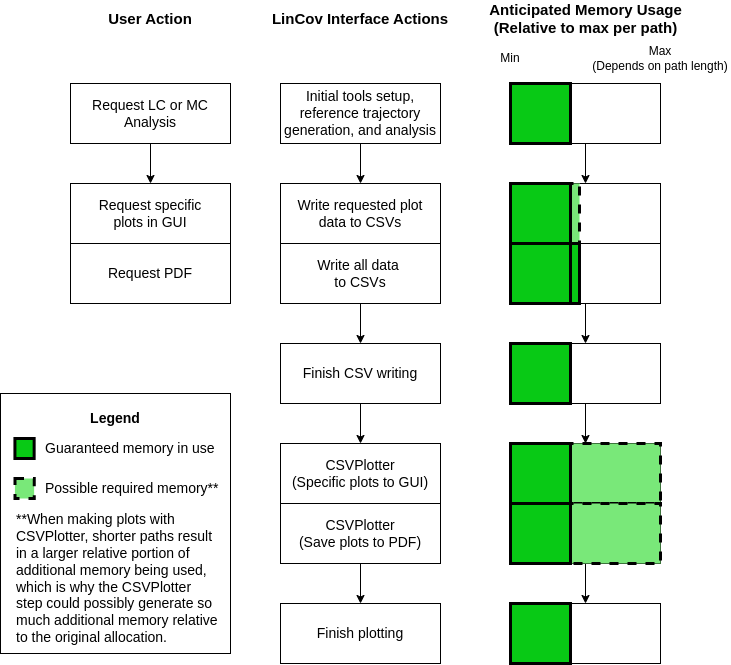

**Table of Contents**
- [Plot Generation and Data Storage](#plot-generation-and-data-storage)
  - [Data Flow Overview](#data-flow-overview)
  - [Reducing Memory Usage](#reducing-memory-usage)
  - [Generating Plots](#generating-plots)
  - [Data Location](#data-location)
- [Data Formatting Guide](#data-formatting-guide)
  - [Possible Data Options List](#possible-data-options-list)
  - [Data Directory Organization](#data-directory-organization)
    - [General Structure](#general-structure)
    - [Structure for `state` Folder](#structure-for-state-folder)
  - [CSV File Headers](#csv-file-headers)
    - [Any MC Runs](#any-mc-runs)
    - [STATE Plots (Limited LC, MC, Limited PDVG)](#state-plots-limited-lc-mc-limited-pdvg)
    - [NON-STATE Plots (LC, MC, PDVG)](#non-state-plots-lc-mc-pdvg)
    - [TRUTH/NAV DISP OFF REF Plots (MC Only)](#truthnav-disp-off-ref-plots-mc-only)
    - [Probability of Detection Plots (PDVG Only)](#probability-of-detection-plots-pdvg-only)
    - [Error Budget (PDVG Only)](#error-budget-pdvg-only)
- [Plot Titles and Labels](#plot-titles-and-labels)


# Plot Generation and Data Storage
After the buttons to generate plots or PDFs are clicked in the *LinCov Analysis Panel* or
*PDVG Panel*, what happens in the background can put a significant load on the user's computer.
This section of the document explains the high-level details of how the data-saving
process takes place. Important details include when data is generated, how long data
stays in memory, and file storage details. Understanding this will help the user to understand
what limitations might exist for their computer when generating plots for LinCov or Monte Carlo
data. The main contributions to large memory usage are long LinCov/Monte Carlo path and showing
large numbers of the interactive plots on screen simultaneously.

## Data Flow Overview
A simple diagram of expected memory usage for the LinCov interface operations is shown here,
and the table below it gives some more detail about each of the steps. A similar chart may be
imagined for the PDVG operations, with a significant memory usage reduction. PDVG operations use
far less resources than the LinCov/Monte Carlo ones.




| Step        |                   Action                   |                                 LinCovInterface Node Event                             |   Anticipated Memory Usage (Bytes) from Major Contributors   |
|:-----------:|:-------------------------------------------|:---------------------------------------------------------------------------------------|:-------------------------------------------------------------|
| 1           | Request LinCov or Monte Carlo Analysis     | Initialize tools, make reference trajectory, perform analysis                          | `lc_mem = 2903 * sizeof(double) * sim_len`                   |
|             |                                            |                                                                                        | `mc_mem = 649 * sizeof(double) * mc_runs * sim_len`          |
|             |                                            |                                                                                        | Let `total_mem = lc_mem + mc_mem`                            |
| 2(a)        | User requests specific plots to be created | All data passed by reference to a function that writes plot data to CSV files.         | `total_mem <= (lc_mem + mc_mem)*1.15`                        |
|     OR      |                                            | Plot-specific parts of original data copied to data structures better for `matplotlib` | `n` is subscript to `nth` requested plot                     |
| 2(b)        | User requests PDF to be generated          | Create CSV files for all plot/data combinations (up to 60)                             | Approximately `total_mem *= 1.15`                            |
|             |                                            | All original requested data is copied to structures that work better for `matplotlib`  |                                                              |
| 3           | ---                                        | Data stored in CSV files and file generation function finishes work                    | Memory usage returns to `total_mem = lc_mem + mc_mem`        |
| 4           | ---                                        | Request made to CSV plotting node and Python-based plotting begins in a sub-process    | If 2.1 taken: `total_mem < total_mem * 3` (approximate max)  |
|             | ---                                        |                                                                                        | If 2.2 taken: `total_mem < total_mem * 2.5` (approximate)    |
| 5           | ---                                        | Plots are closed, plot memory is released, and CSVPlotter subprocesses are killed.     | Memory usage returns to `total_mem = lc_mem + mc_mem`        |

## Reducing Memory Usage
There are a few things that can be done about reducing the overall memory usage, at the expense
of coarser resolution in the plots. The most significant factor is the size of the time-step used
for calculating the LinCov and Monte Carlo analyses. This can be changed by modifying the
`lc_mc_period` value in the `scenario_params.py` file in the `pd_planner_launch` package.

A secondary factor that can reduce memory usage is lowering the number of Monte Carlo runs produced
when making an analysis call. Refer to the `README` for the `rviz_plugins` package to see how this
is done.

## Generating Plots
There are a few methods of generating plots. Each has advantages and disadvantages.

| Plotting Method |                                 Pros                             |                                                     Cons                                                   |
|:---------------:|:-----------------------------------------------------------------|:-----------------------------------------------------------------------------------------------------------|
| *Gen. PDF*      | All plots can be viewed from a single PDF                        | Not interactive                                                                                            |
|                 | Memory usage at a minimum                                        | Generating all plots and saving to PDF is time-consuming                                                   |
| *Gen. Plots*    | Interactive plots                                                | Significantly increased memory usage while plots are open compared to amount used for same plot in the PDF |
|                 | Time to finish is much faster if only wanting to see a few plots |                                                                                                            |

## Data Location
The location for the test data is specified in the `csv_directory.py` parameters file in the
`pd_planner_launch` package. The location is specified by the `CSV_DATA_DIRECTORY` parameter.
The next section describes the structure of the data directory.

# Data Formatting Guide
This section provides an overview of CSV file structure and CSV data directory structure. These
structures have been implemented in some form or another in the following files in their respective
packages and repositories:

 - `scenario` repo:
  - `planner_interface` package
    - `make_statistics_csv.hpp`
    - `lincov_interface.hpp/cpp`
    - `pdvg_interface.hpp/cpp`
    - `csv_plotter.py`
    - `csv_params.py`**
  - `rviz_plugins` package
    - `lincov_analysis_panel.hpp/cpp`
    - `lincov_analysis_panel_node.hpp/cpp`
    - `pdvg_panel.hpp/cpp`
    - `pdvg_panel_node.hpp/cpp`
  - `pd_planner_launch` package
    - `pd_planner_launch/params/csv_directory.py`

\*\* These files contain the most critical information across all of these files.
Each has strings defined in either lists or structures in Python or C++ respectively.
These files allow for generalization across all the other related files.

The sets of strings that **must remain consistent** between the two files mentioned
in the previous paragraph have the same names in one form or another:

- `CSVNames::DirectoryNames` (C++) / `DIRECTORY_NAMES` (Python)
- `CSVNames::FileNames` (C++) / `FILE_NAMES` (Python)
- One-off file names (for pdf files and some PDVG-specific plots)
- File suffixes
- Name of MC Runs directory

If these names are not kept consistent, the plotting **will not work as expected**. There will be
a guaranteed file read error or non-existent data. There are some extra strings
that have been defined in the C++ version that aren't needed in the Python version
because of how Monte Carlo runs are read. There are also a few plot types
utilized in LinCov/Monte Carlo plots that aren't used in PDVG plots.
This information and structure has been as generalized as possible
between C++ and Python, but each still depends on the parameter file information
matching up to operate properly.

## Possible Data Options List
The data available will be a combination of a *Plot Type* and a *Data Type*, where
the *Data Types* are treated as a subcategory in the directory organization. For example,
to find a *Navigation Dispersion* file for *Heading* data, one would look in the
`nav_disp/` directory then in the `heading_bias/` subdirectory. More of
this is explained in the *Data Directory Organization* section.

Below is a table of what will be available in the specified data structure. One can
refer to the names and dimensions of the data types in order to write or modify
any code that extracts the data.

|               Plot Types              |     Data Types    | Data Type Dimensions |
|:--------------------------------------|:------------------|:--------------------:|
| State                                 | Position          |           3          |
| Truth Dispersion                      | Euler             |           3          |
| Navigation Dispersion                 | Velocity          |           3          |
| Estimated Error                       | Heading           |           1          |
| Truth Dispersion off Reference**      | Absolute Pressure |           1          |
| Navigation Dispersion off Reference** | Feature Range     |           1          |
|                                       | Feature Bearing   |           3          |
|                                       | GPS Position      |           3          |
|                                       | Gyroscope         |           3          |
|                                       | Accelerometer     |           3          |

\*\* These plot types are not available for LinCov-only or PDVG plots

## Data Directory Organization
Shown below is the directory structure for the CSV data generated.
Almost all plot types (`state`, `truth_disp`, `est_error`, etc.) contain
the same subdirectory structure. The only exception is for the `state` type, which
has no subdirectory for Monte Carlo runs and different file names.
The `all_plots.pdf` file will be generated after the user clicks the
`Gen. PDF (All Plots)` button in the `rviz` GUI.

### General Structure
```
test_data
|
|- all_plots.pdf
|- pdvg.csv
|- error_budget.csv
|- <plot_type_name>
|  |
|  |- <data_type_name>
|    |
|    |- <data_type_name>_uncertainty.csv
|    |- mc_runs**
|      |
|      |- mc_run0.csv
|      |- mc_run1.csv
|      |- ...
|      |- mc_runX.csv
```

### Structure for `state` Folder
The `state` plots use different data than any other plot type, so a different
file structure is necessary. This structure is shown below. Note that all three
files that appear in the example here will not be created for every data type.
Another thing to be aware of is that for LinCov-only and PDVG data, **state plots
are only generated for Position, Euler Angles, and NED Velocity data types**. So don't
be confused if a state plot is selected for PDVG or LinCov-only and you don't get one
because it isn't one of the types above.
```
|- state
  |
  |- <data_type_name>
    |
    |- <data_type_name>_truth.csv
    |- <data_type_name>_ref.csv
    |- <data_type_name>_nav.csv
```

## CSV File Headers
Any information stored in a CSV will simply be formatted as shown here. If only
LinCov data has been requested, then the files containing non-state plots will
only have the columns with LC in them. The file headers will differ in accordance
with the dimensions of the plot category. Examples show 3-dimensional versions:

===================================================================
### Any MC Runs

|Time| X  | Y  | Z  |
|:--:|:--:|:--:|:--:|
|....|....|....|....|

===================================================================
### STATE Plots (Limited LC, MC, Limited PDVG)
*ANY REF, NAV, OR TRUTH FILES*
|Time| X | Y | Z |
|:--:|:-:|:-:|:-:|
|....|...|...|...|

===================================================================
### NON-STATE Plots (LC, MC, PDVG)
*3-SIGMA BOUNDS FILE*
|Time|3-sigma LC X|3-sigma LC Y|3-sigma LC Z|3-sigma MC X|3-sigma MC Y|3-sigma MC Z|
|:--:|:-:|:-:|:-:|:-:|:-:|:-:|
|....|...|...|...|...|...|...|

===================================================================
### TRUTH/NAV DISP OFF REF Plots (MC Only)
*3-SIGMA BOUNDS FILE*
|Time|3-sigma MC X|3-sigma MC Y|3-sigma MC Z|
|:--:|:-:|:-:|:-:|
|....|...|...|...|

===================================================================
### Probability of Detection Plots (PDVG Only)
|Time|PD|PD Uncertainty|Range|Radar Cross Section|
|:--:|:-:|:-:|:-:|:-:|
|....|...|...|...|...|

===================================================================
### Error Budget (PDVG Only)
Only the *Time* and *Total* columns need to be fixed in position as shown below.
Other columns can be rearranged and still appear on the resulting plot as expected

|Time|Total|Heading Bias|Heading|Abs Pressure Bias|Feature Range Bias|Feature Bearing Bias|GPS Position Bias|GPS Position|Gyro Bias|Gyroscope|Accel Bias|Accelerometer|Radar Position|Radar Constant|Initial Truth State Variance|
|:--:|:-:|:-:|:-:|:-:|:-:|:-:|:-:|:-:|:-:|:-:|:-:|:-:|:-:|:-:|:-:|
|....|...|...|...|...|...|...|...|...|...|...|...|...|...|...|...|

===================================================================
# Plot Titles and Labels
This table shows what the user can expect regarding how the plots will be
differentiated with labels and other plot information. The `data_type_title` is one of
*Position*, *Euler Angles*, *NED Velocity*, etc... The titles used can be found in the
`plot_statistics_tools.hpp` file in the `kalman_filter` package and duplicates are
stored in the `csv_params.py` file in the `planner_interface` package.


|         Plot Type        |                            Title                          |              X/Y/Z Labels              |                     Legend(s)                  |
|:-------------------------|:----------------------------------------------------------|:---------------------------------------|:-----------------------------------------------|
| STATE                    | `data_type_title`                                         | `data_type_title` Avg. X/Y/Z           | Reference, Avg. Truth, Avg. Navigation         |
| TRUTH_DISP               | `data_type_title` Truth Dispersion                        | `data_type_title` X/Y/Z Truth Disp     | 3-sigma MC, 3-sigma LC/PDVG                    |
| NAV_DISP                 | `data_type_title` Navigation Dispersion                   | `data_type_title` X/Y/Z Nav Disp       | 3-sigma MC, 3-sigma LC/PDVG                    |
| EST_ERROR                | `data_type_title` Est. Error                              | `data_type_title` X/Y/Z Est. Error     | 3-sigma MC, 3-sigma LC/PDVG                    |
| TRUTH_DISP_OFF_REF       | `data_type_title` Truth Dispersion Ref off Reference      | `data_type_title` X/Y/Z Truth Disp Ref | 3-sigma MC                                     |
| NAV_DISP_OFF_REF         | `data_type_title` Navigation Dispersion Ref off Reference | `data_type_title` X/Y/Z Nav Disp Ref   | 3-sigma MC                                     |
| Probability of Detection | Probabilty of Detection Plots                             | PD, Range, RCS                         | PD, PD + \<x\>-sigma, PD Threshold, Range, RCS |
