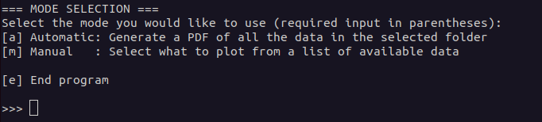
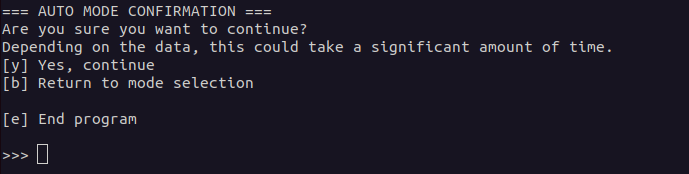
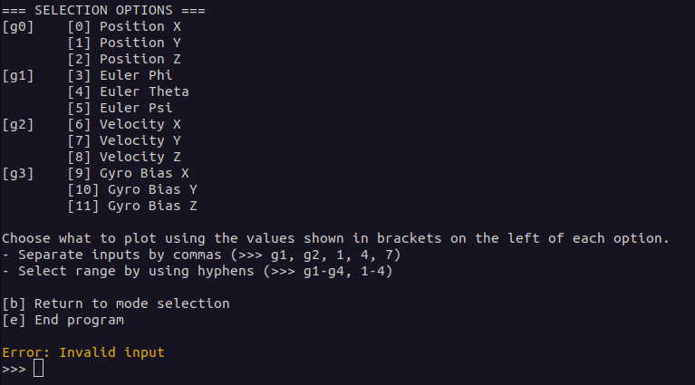
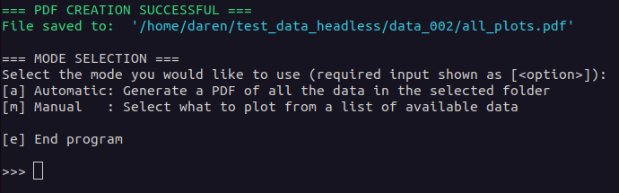

**Table of Contents**
- [MCPlotter User Guide](#mcplotter-user-guide)
  - [Summary of Functionality](#summary-of-functionality)
  - [Usage](#usage)
    - [Preliminary Steps](#preliminary-steps)
    - [Operating `MCPlotter`:](#operating-mcplotter)


# MCPlotter User Guide
## Summary of Functionality
The `MCPlotter` operates from a Python script located in the `planner_interface` package.
It is designed to be run from the command line. It takes a single argument from the user, a directory
containing Monte Carlo run data produced by headless Monte Carlo simulations (more on this in the 
`Usage` section).

During operation, the `MCPlotter` provides the user a menu from which to select how to plot.
The first option is `Automatic`, which produces a PDF of all Monte Carlo data for every data type contained
in the selected data set. The `Manual` option allows the user to select specific data or groups of
data to plot in interactive mode. The next section explains this in detail.


## Usage
### Preliminary Steps
```
1. Source your ROS workspace
2. Activate your Python virtual environment (if you use one)
3. Locate a data set from which to generate plots.

    Check the `CSV_DATA_DIRECTORY_HEADLESS` variable
    in `csv_directory.py` in the `pd_planner_launch/pd_planner_launch/params/csv_directory.py` file
    to find where the data was saved. This data is produced when the `headless_sim_scenario.launch.py`
    launch file is used. An example directory would be '~/test_data_headless/'

3. After finding a data set, **copy the absolute path** to a specific folder (e.g. `~/.../test_data_headless/data_002/`)

    Regardless of the folder name, the path you provide should be the parent directory of a bunch
    of directories named as `run_000`, `run_001`, ..., `run_xxx`. These were generated by the
    headless simulation. As long as the names of the files inside are left alone, the names of the
    run directories does not matter. When parallel simulations have been used, the files could
    be renamed as 'run_000_1, run_001_1, ...` and still be valid for use.
```

### Operating `MCPlotter`:
Run the command `ros2 run planner_interface mc_plotter_run.py <data path>` and insert the absolute
path of the data directory obtained above in place of `<data path>`.

If the data directory provided is valid, you will see the following menu appear, in which the options
should be fairly self-explanatory:



From here, simply input one of the letters indicated in brackets and press enter to confirm your
choice. If you give a bad input, an error message will be presented until you provide a good input.
If you select `'a'`, this menu will appear:



Since there could potentially be a lot of data to read through and plot, the `Automatic` mode could take
quite a while. Read the menu to decide what to do from here.

If you selected `'m'` from the startup menu, you will see a menu that looks something like in the next
image. Each of the states collected in the simulation process are determined by the `MCPlotter`
and from there are organized and formed into groups that represent similar states. This usually
happens in sets of three (Note that this image also includes and example of an error message).
Groups of data include every listing adjacent to and beneath one of the group indicators `[g0]`.
To select groups, the user can type what is in the group indicators as their input. More detail
is provided in the menu itself as to what the user can do to vary their selections.



Again, follow the instructions provided in the menu to proceed.

For either `Automatic` or `Manual` mode if the plotting is started, a progress bar will appear to
provide visual feedback as to the status of the plotting operation. Any waiting time after the bar
reaches `100%` is typically due to either saving the plots to the PDF or waiting for the interactive
plots to actually appear on-screen.


Once complete, a success message will appear back on the screen and bring the user back to the
startup menu. If the `Automatic` mode was selected, the absolute path to the location of the
PDF file will be shown directly underneath the success message.



From here, the user can end the program or continue using it as prompted by the menus.

