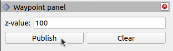

**Table of Contents**
- [RVIZ Plugins](#rviz-plugins)
  - [Summary](#summary)
  - [`lincov_analysis_panel` Plugin](#lincov_analysis_panel-plugin)
    - [Adding the Panel to rviz](#adding-the-panel-to-rviz)
    - [Internal ROS2 Node](#internal-ros2-node)
    - [Using the LinCov Analysis Panel](#using-the-lincov-analysis-panel)
      - [**Performing Monte Carlo and/or LinCov Analyses**](#performing-monte-carlo-andor-lincov-analyses)
      - [**Generating Plots**](#generating-plots)
      - [**Toggling Uncertainty Ellipses**](#toggling-uncertainty-ellipses)
  - [`pdvg_panel` Plugin](#pdvg_panel-plugin)
    - [Adding the Panel to rviz](#adding-the-panel-to-rviz-1)
    - [Internal ROS2 Node](#internal-ros2-node-1)
    - [Using the PDVG Panel](#using-the-pdvg-panel)
      - [**Making a PDVG Plan**](#making-a-pdvg-plan)
      - [**Generating Plots**](#generating-plots-1)


# RVIZ Plugins
## Summary
The `rviz_plugins` package provides the following RVIZ plugins:

- `lincov_analysis_panel`
- `pdvg_panel`

Once this package is installed in your `ros` workspace, both
of the panels will be accessible in `rviz`.

Each panel has example scenarios available as launch files through
the `pd_planner_launch` package. The *LinCov Analysis Panel* provides
good results with `scenario.launch.py` and the *PDVG Panel* can be used
with the `pdvg_scenario.launch.py` launch file.

## `lincov_analysis_panel` Plugin

This plugin is used to provide the user an interface to the
`lincov_interface` node from the `planner_interface` package
via an rviz panel.
The panel contains buttons and textboxes that allows the user
to request Monte Carlo and/or LinCov analyses, generate plots, enable uncertainty
ellipses, and change the spatial resolution of those ellipses.
These functions can be performed at any time while the simulation
from the `pd_planner_launch` package is open because they run in
the background and are not a direct part of the simulation environment.

This plugin implements all the buttons and graphical elements
and connects all of them to services in the `lincov_interface`
node by utilizing Qt SIGNALS and SLOTS and an internal `ros2`
node.

### Adding the Panel to rviz
To add the panel to the `rviz` interface, click *Panels* in the
top-left corner of the `rviz` window, then select *Add New Panel*,
the first option in the context menu. If the `lincov_analysis_panel`
was correctly installed, a panel called `LinCovAnalysisPanel` will
be visible in a folder called `rviz_plugins`. Double-click to bring
a new instance of the `lincov_analysis_panel` into the `rviz` GUI.

### Internal ROS2 Node
This node, titled `lincov_analysis_panel_node`, is the service
request side of the services provided by the `lincov_interface`
node. The `lincov_analysis_panel` connects user actions in the
panel GUI to service requests here.

This node contains several flags that indicate the current status
of operations taking place between itself and the `lincov_interface`
node. There are publicly defined getters that allow the
`lincov_analysis_panel` to access those flags and change things
in the GUI to reflect the current state of the node.

**Interfaces**
|             Topic             | Interface Type |   Function    |                 Message Type                 |                                        Description                                     |
|:------------------------------|:--------------:|:-------------:|:---------------------------------------------|:---------------------------------------------------------------------------------------|
|        `plot_results`         |       srv      |    Client     |             `std_srvs::srv::Trigger`         | Request to matplotlib plots after analysis is done                                     |
|        `run_analysis`         |       srv      |    Client     |  `uav_interfaces::srv::LinCovMonteCarloCall` | Request for a Monte Carlo or LinCov analysis                                           |
| `toggle_uncertainty_ellipses` |       srv      |    Client     |     `uav_interfaces::srv::ToggleEllipse`     | Request to plot the uncertainty ellipses at a spatial resolution specified by the user |

*Note about topic names*: Even though the node is somewhat obscured because
it is a member of a parent `rviz` panel plugin, some basic things can still be
done to it upon creation, like remapping its topics. Doing this is the same as
any other remapping action, but it needs to be done from the `rviz2` launch
description.

### Using the LinCov Analysis Panel
*This part assumes you are using the `scenario.launch.py` launch file
from the `pd_planner_launch` package to run a simulation*.

The GUI has been designed in a way that provides as much information to the user
as possible without requiring the user to filter through logger messages in the
command line interface. Buttons can be disabled or enabled during use to indicate
that the `lincov_interface` is in the middle of a process. Button color can change
depending on the results of the service requests. Button text also changes
to reflect the current options available to the user. Above is an image of all the
buttons and text boxes enabled.


#### **Performing Monte Carlo and/or LinCov Analyses**
When a panel is created, only the *LinCov/MonteCarlo Analysis* buttons will be
enabled as shown in **Image 1**.

None of the operations can be performed if an analysis hasn't been performed
first, so none of the other buttons can be clicked yet. If you go ahead
and click either of the analysis buttons, assuming you haven't done anything else,
you'll notice that the button turns red and gives you a status message for a few
seconds: *No waypoints were published*, as in **Image 2**.

This and a few other error messages can show up when using the panel. The other ones
will appear if the `lincov_interface` node isn't spun up, if there is too narrow of
an angle between three successive waypoints, or if fewer than three waypoints
were published. Speaking of waypoints, let's talk about how to access other
features of this panel.

The waypoints can be created by using the 2D Goal Pose button in `rviz` as shown in
the **Image 3**. Click the button then click a spot in the simulation world to
place the waypoint. Unfortunately the button must be clicked every time for every
new waypoint.

After a sequence of waypoints has been created, click on the publish button in the
*Waypoints* panel (**Image 4**). Now if you click on either of the analysis
buttons, it will actually do the analysis, and will look like the image in **Image 5**.
When the analysis is completed, you will see the result as shown in **Image 6** for
a few seconds, at which point the panel will look like what is shown in **Image 7**.

For the *Monte Carlo Analysis* button, a parameter can be set in the
*Monte Carlo Runs* textbox. The number in the box is represents the number of Monte
Carlo simulations to perform when the Monte Carlo analysis is requested.

Another parameter, *MC Run Downsample Factor*, can be set to modify the output data
that will be used to make plots. For some number of runs, the number of runs to actually
be displayed in plots will be `n_runs/mc_run_downsample_factor`.

|                                 Description                               |                                      Image                                    |
|:--------------------------------------------------------------------------|:-----------------------------------------------------------------------------:|
| **Image 1**: Initial panel state                                          |              |
| **Image 2**: If an analysis button is clicked without published waypoints |               |
| **Image 3**: Button used to set waypoints                                 |         |
| **Image 4**: Button used to publish waypoints                             |    |
| **Image 5**: While an analysis is processing                              |                    |
| **Image 6**: Successful completion of analysis                            |               |
| **Image 7**: Fully enabled                                                |                |
| **Image 8**: Plot Types Dropdown                                          |  |
| **Image 9**: Data Types Dropdown                                          |  |

#### **Generating Plots**
Once the first analysis has been performed, you can select desired plot types
and data types to make plots for in the dropdown menus labelled as such. This
can be seen in **Image 8** and **Image 9**. When selections are made, the number
selected appears in the textbox of the dropdown menu. Once selected, you can
click *Gen. Plots* to open up plots of the information you selected.

See the [`lc_mc_plots_rviz_guide.md`](../planner_interface/docs/lc_mc_plots_rviz_guide.md) for more
details regarding plotting, including a flow-chart of how plots are produced and
memory management information.

#### **Toggling Uncertainty Ellipses**
The *Turn Uncertainty Ellipses On* button is pretty self-explanatory. Once clicked,
the uncertainty ellipses will be produced at the spatial resolution provided by
the value in the text entry box below the button. The ellipses can be turned on and off
freely when the button is active. The spatial resolution can also be changed without
issue, then the ellipses toggled again.

The button will change its text to reflect the state of the ellipses. If they are visible,
the button will read *Turn Uncertainty Ellipses Off*, and vice versa. Note that these
uncertainty ellipses can be *very* small, but you should be able to find them if you
look closely along the brown line produced by the waypoint path.

For testing purposes, a scaling factor has been provided as a parameter called
`test_scale` in the `scenario_params.py` configuration file within the
`rviz_3sig_ellipse_parameters` function. A value of `1` is the default, and anything
bigger will scale the X and Y axes of the ellipse marker accordingly.

The command below can be used to switch the scale if desired. The scale value must be
a double value (include a `.xxx` as part of the number). If the ellipses are already
on, they should be turned off and on again to see the changes.

```
ros2 param set /lincov_interface ellipses.test_scale <scale value>
```

## `pdvg_panel` Plugin
This plugin functions similarly to the `lincov_analysis_panel`. It uses a node
internally to access a PDVG planner node. This panel provides a button for requesting
to generate a plan. Depending on the results in the service response, the
*Make PDVG Plan* button will change colors and text to indicate to the user the
service status.

### Adding the Panel to rviz
Refer to the instructions above for adding the `lincov_analysis_panel`. Just add
this panel instead.

### Internal ROS2 Node
The node internal to the `pdvg_panel` maintains flags and status messages
regarding the current state of the PDVG planning request and response. These
flags and messages can be accessed by the "parent" `PDVGPanel` object. The
`PDVGPanel` object will use the provided information to update the state of the
button with different colors and text to indicate to the user what has happened
with the most recent service request and response.

Interactions with the PDVG planner node are defined below:
**Interfaces**
|    Topic    | Interface Type |   Function    |                Message Type               |                Description               |
|:------------|:--------------:|:-------------:|:------------------------------------------|:-----------------------------------------|
| `run_pdvg`  |      srv       |    Client     | `std_srvs::srv::Trigger`                  | Request to make a PDVG plan              |
| `pdvg_plot` |      srv       |    Client     | `uav_interfaces::srv::SelectAnalysisPlot` | Request to generate plots from PDVG data |

### Using the PDVG Panel
The usage of the PDVG panel is very similar to the LinCov/Monte Carlo panel. The panel
can be utilized in either the `scenario.launch.py` or the `pdvg_scenario.launch.py`
scenarios in the `planner_interface` package. The `pdvg_scenario.launch.py` launch
option is designed with very specific visualized radar ranges. Each range is a fair
approximation to the region within which the PDVG plan would actually fail.

To start, given the limited space available in the RVIZ sidebar, the PDVG Panel is
actually in a tab toolbar in a group with the LinCov Analysis Panel. To show the
PDVG Panel, click on its tab as shown in **Image 10**.

When the panel is first started up, certain buttons will be disabled, just as in the
the LinCov Analysis panel. Refer to **Image 10** below to learn how that will look.

#### **Making a PDVG Plan**
To make a PDVG plan, a goal position needs to be set.
This is done in the same way that waypoints are set for operation of the LinCov
interface. As in **Image 3** and **Image 4** above, click the *2D Goal Pose* button,
set the desired goal point, then click *Publish* in the Waypoint panel.

The published waypoint should then be set as the goal/target point by the
`pdvg_interface` node. Once this has happened, click the *Make PDVG Plan* button. If
the published waypoint is in a place the planner can't make a plan that satisfies all
the planning parameters, the user will see a message displayed on the *Make PDVG Plan*
button and it will turn red. If the plan succeeds, the button will turn green and
display a message indicating the success.

After successful generation of a PDVG plan, the path to follow will be published to
RVIZ through the `/waypoints_viz` topic, allowing the UAV to follow the path. An example
can be seen in **Image 13**.

|                       Description                            |                            Image                            |
|:-------------------------------------------------------------|:-----------------------------------------------------------:|
| **Image 10**: PDVG Panel Tab                                 |              |
| **Image 11**: Initial panel state                            |  |
| **Image 12**: Fully enabled panel                            |   |
| **Image 13**: Path example                                   |       |

#### **Generating Plots**

Generating plots for uncertainty results should be done through the *LinCov Analysis Panel*.
PDVG-exclusive plots can be generated as described below.

The *Plot PD* button will make a plot of the Probability of Detection information. This
plot shows the probability of detection, probability of detection threshold,
standard deviation bounds for probability of detection scaled by a parameter for the
PDVG interface, radar cross section, and range information.

The *Plot Error Budget* will make a plot showing the error contributions from each
relevant sensor and state.

All the data for the plots are, like with the LinCov data, stored in the directory
specified in `csv_directory.py` in the `pd_planner_launch` package.

